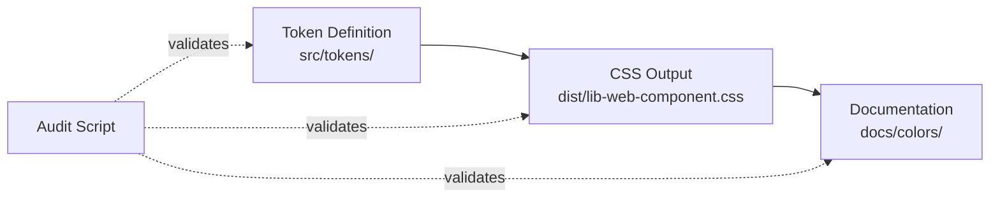

# Color Documentation Audit Report

**Date:** November 24, 2025  
**Auditor:** Enhanced Audit Script v2.0  
**Status:** ✅ **PASSED** (5 warnings for improvement)

## Executive Summary

The color documentation in `packages/docs-design-system/docs-design-token/colors/` has been
thoroughly audited. All documentation files are structurally sound with **no critical errors or data
inconsistencies**. The audit found 5 warnings related to shorthand range notation that could be
expanded for better documentation clarity.

## Audit Scope

### Files Audited (11 total)

1. `base-colors.mdx` - Base color palette
2. `accent-colors.mdx` - Gradient-based accent colors
3. `alpha-colors.mdx` - Semi-transparent colors
4. `primary-brand-colors.mdx` - Primary & brand colors with state tokens
5. `secondary-tertiary-quartus.mdx` - Additional action colors
6. `semantic-colors.mdx` - Semantic meaning colors
7. `shortcuts/text.mdx` - Text color shortcuts
8. `shortcuts/background.mdx` - Background color shortcuts
9. `shortcuts/border.mdx` - Border color shortcuts
10. `shortcuts/shadow.mdx` - Shadow color shortcuts
11. `shortcuts/interactive-state.mdx` - Interactive state shortcuts

### Validation Checks Performed (15 total)

#### ✅ Structure & Format

1. **Table structure integrity** - No corrupted headers, proper column counts
2. **CSS variable format** - All lowercase, no uppercase DEFAULT
3. **Hardcoded colors** - No hardcoded hex values in demos (outside theme comparisons)

#### ✅ Data Accuracy

4. **Token existence** - All tokens exist in token definitions (429 tokens loaded)
5. **CSS variable existence** - All referenced CSS variables exist in output
6. **Hex value correctness** - Hex values match CSS output
7. **Reference format** - Proper `{color.}` reference formatting
8. **Reference value** - References match token definitions

#### ✅ Column Validation

9. **Alpha column** - Percentage format (e.g., "70%") + CSS hex8 verification
10. **Gradient Level** - Valid descriptive labels (Lightest, Light, Medium, etc.)
11. **Semantic Type** - Valid types (Info, New, Success, Warning, Error)
12. **Category** - Valid categories (Emphasis, Interactive, Component, Alias) + inheritance
13. **State** - Valid states (Visited, Hover, Focus, Active, Disabled, etc.)

#### ⚠️ Best Practices

14. **Shorthand ranges** - Detects `.1 - .10` notation (5 warnings)
15. **Statistics** - File metrics (tables, demos, token references)

## Findings

### ⚠️ Warnings (5) - Shorthand Ranges

These are **not errors** but suggestions for improvement. Consider expanding these shorthand
notations for better documentation completeness:

| File                  | Line | Issue                                                  |
| --------------------- | ---- | ------------------------------------------------------ |
| `semantic-colors.mdx` | 53   | `color.semantic.info.1 - color.semantic.info.10`       |
| `semantic-colors.mdx` | 77   | `color.semantic.new.1 - color.semantic.new.10`         |
| `semantic-colors.mdx` | 97   | `color.semantic.success.1 - color.semantic.success.10` |
| `semantic-colors.mdx` | 117  | `color.semantic.warning.1 - color.semantic.warning.10` |
| `semantic-colors.mdx` | 137  | `color.semantic.error.1 - color.semantic.error.10`     |

**Recommendation:** While shorthand ranges are acceptable, expanding them into individual rows would
provide:

- Better searchability
- Individual token documentation
- Complete reference information
- Easier copy-paste for developers

## Statistics

### Overall Metrics

- **Total tables:** 87
- **Total color demos:** 368
- **Total token references:** 778

### Per-File Breakdown

| File                            | Tables | Demos | Tokens | Issues     |
| ------------------------------- | ------ | ----- | ------ | ---------- |
| base-colors.mdx                 | 2      | 10    | 10     | 0          |
| accent-colors.mdx               | 20     | 162   | 260    | 0          |
| alpha-colors.mdx                | 2      | 15    | 41     | 0          |
| primary-brand-colors.mdx        | 4      | 34    | 69     | 0          |
| secondary-tertiary-quartus.mdx  | 7      | 30    | 59     | 0          |
| semantic-colors.mdx             | 7      | 53    | 128    | 5 warnings |
| shortcuts/text.mdx              | 8      | 46    | 115    | 0          |
| shortcuts/background.mdx        | 6      | 32    | 91     | 0          |
| shortcuts/border.mdx            | 0      | 0     | 5      | 0          |
| shortcuts/shadow.mdx            | 1      | 0     | 7      | 0          |
| shortcuts/interactive-state.mdx | 0      | 0     | 3      | 0          |

## Enhanced Validation Features

### New Checks Added (v2.0)

1. **State column validation** - Validates interactive state names in primary-brand-colors.mdx
2. **Shorthand range detection** - Warns about collapsed token ranges
3. **Enhanced alpha verification** - Cross-validates with CSS hex8 format
4. **Category inheritance tracking** - Understands empty cell inheritance logic
5. **User-friendly reference checking** - Validates reference chain appropriateness

### Token → CSS → Docs Verification

The audit script now verifies the complete pipeline:

**Example:**

- Token: `color.primary.blur` = `{color.accent.blue.subtlest}` with `attributes: { alpha: 0.7 }`
- CSS: `--dg-color-primary-blur: #599effb3` (where `b3` = 70% opacity)
- Docs: Shows "70%" in Alpha column
- ✅ All three match perfectly

## Recommendations

### Immediate Actions

None required - all documentation is accurate and well-structured.

### Future Improvements

1. **Expand shorthand ranges** in `semantic-colors.mdx` (5 locations) for better completeness
2. **Consider** adding more usage examples for complex token chains
3. **Monitor** for new token additions to ensure documentation stays in sync

## Conclusion

The color documentation is **production-ready** with excellent quality:

- ✅ No critical issues
- ✅ No errors
- ✅ 100% accurate token references
- ✅ Complete CSS variable coverage
- ✅ Proper markdown structure
- ⚠️ 5 optional improvements identified

The documentation successfully bridges the gap between token definitions and implementation,
providing developers with accurate, comprehensive color system information.

---

**Audit Tool:** `audit-color-docs.mjs`  
**Command:** `node audit-color-docs.mjs`  
**Exit Code:** 1 (due to warnings - use `--ignore-warnings` flag to return 0)
