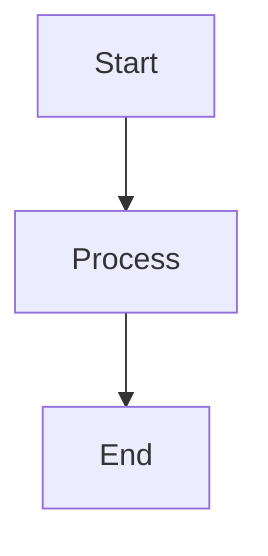
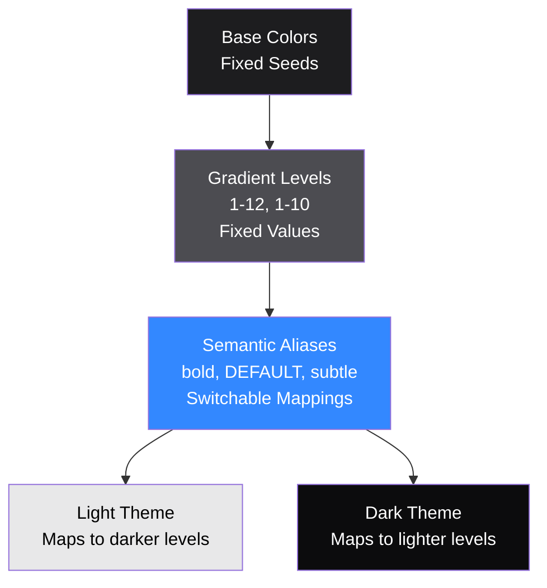
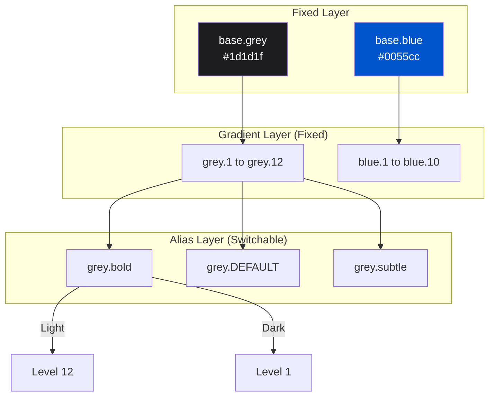
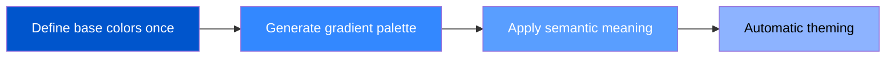
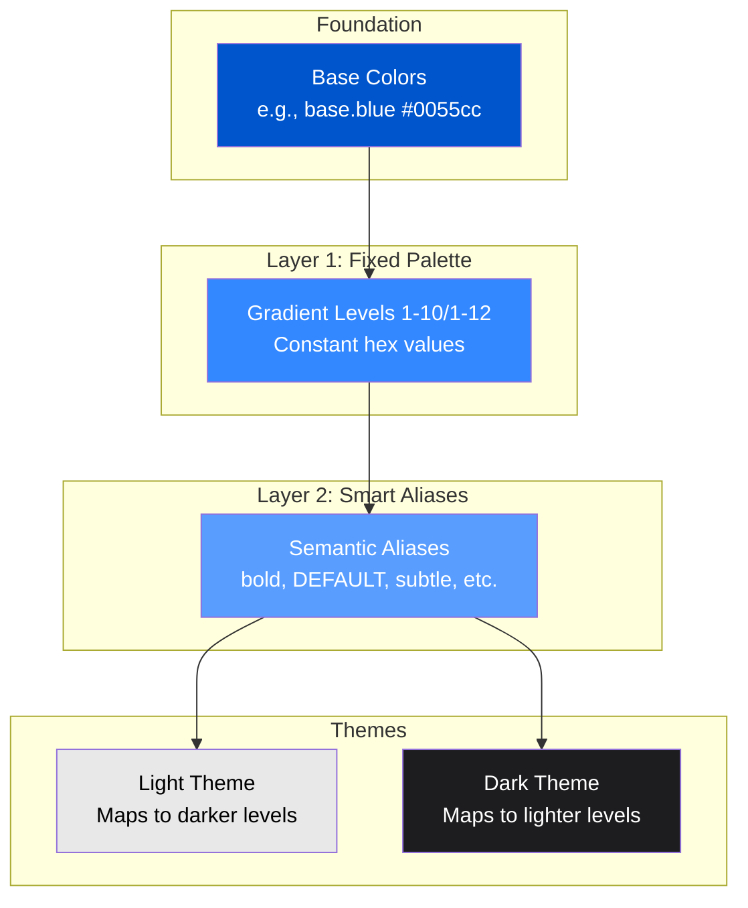
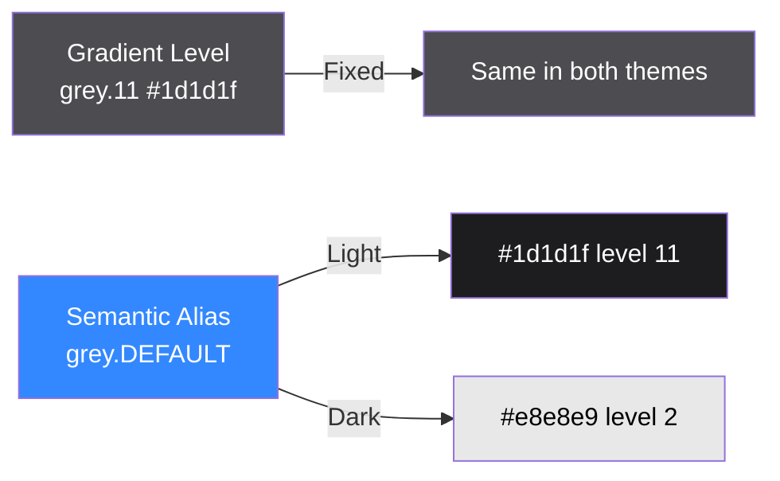

# Mermaid Configuration Guide

## ✅ Configuration Complete

Mermaid diagram support has been successfully added to Docusaurus!

### Changes Made

**1. Package Installed:**

```json
{
  "dependencies": {
    "@docusaurus/theme-mermaid": "3.9.2"
  }
}
```

**2. Docusaurus Config Updated:**

```typescript
themes: [
  '@docusaurus/theme-mermaid',  // ← Added
  // ... other themes
],

markdown: {
  mermaid: true  // ← Added
},
```

## 📝 How to Use Mermaid

### Basic Syntax

Use triple backticks with `mermaid` language:

````markdown

````

### Example Diagrams for Theme-Aware Colors

#### 1. Color System Architecture

````markdown

````

#### 2. Fixed vs Switchable Flow

````markdown

````

#### 3. Theme Switching Hierarchy

````markdown

````

#### 4. Simple Linear Flow

````markdown

````

## 🎨 Suggested Placements

### theme-aware-colors.mdx

Add this diagram under "Two-Layer Architecture":

````markdown
## Two-Layer Architecture

The Design Great color system is built on **base colors** and uses a **two-layer architecture**:


````

### accent-colors.mdx

Add this under "Theme Adaptation":

````markdown

````

## 📚 Mermaid Resources

- [Mermaid Official Docs](https://mermaid.js.org/)
- [Flowchart Syntax](https://mermaid.js.org/syntax/flowchart.html)
- [Graph Syntax](https://mermaid.js.org/syntax/graph.html)
- [Styling](https://mermaid.js.org/syntax/flowchart.html#styling-and-classes)

## 🚀 Next Steps

1. Start the dev server: `pnpm dev`
2. Add Mermaid diagrams to your documentation
3. Test that they render correctly in both light and dark themes
4. Adjust colors/styling as needed

## 🎨 Theme-Aware Styling

Mermaid diagrams inherit the site's theme. You can customize colors:


## ✅ Validation

To verify Mermaid is working:

1. Run `pnpm dev`
2. Navigate to any page with a Mermaid diagram
3. Check that the diagram renders correctly
4. Switch between light/dark themes to verify appearance

---

**Status:** ✅ CONFIGURED **Package:** @docusaurus/theme-mermaid@3.9.2 **Documentation:** Ready to
use Mermaid diagrams!
