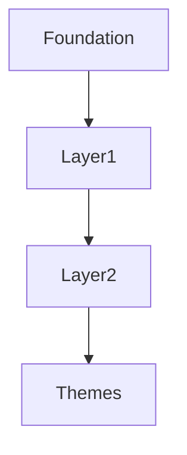
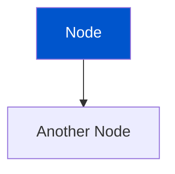

# Mermaid Diagram Enhancement Summary

**Date:** November 24, 2025  
**Enhancement:** Added Mermaid diagrams to Theme-Aware Color Concepts documentation

## 🎨 Visual Enhancements Made

### 1. Two-Layer Architecture - Main Diagram

**Purpose:** Show the complete architecture from foundation to theme adaptation



**Features:**

- 🎨 **Foundation Layer**: Shows base colors (grey, blue, red) with actual hex values
- 📊 **Layer 1 (Fixed Palette)**: Displays gradient level ranges (grey.1-12, blue.1-10, etc.)
- 🔄 **Layer 2 (Smart Aliases)**: Lists semantic aliases (bold, DEFAULT, subtle)
- 🌓 **Theme Adaptation**: Shows how aliases map to Light/Dark themes

**Visual Design:**

- Color-coded subgraphs for each layer
- Blue tones for foundation (matches base.blue)
- Grey for fixed palette
- Orange for smart aliases
- Green for theme adaptation
- Emoji icons for quick recognition

### 2. Key Concept Flow - Simplified Diagram

**Purpose:** Show the linear flow from base to themes in a simple, easy-to-understand format

```mermaid
Base Colors → Gradient Levels → Semantic Aliases → Light/Dark Themes
```

**Features:**

- Linear left-to-right flow
- Progressive color gradient (blue to dark)
- Shows the transformation at each step
- Emphasizes the "switch mapping" to themes

**Visual Design:**

- Gradient blue progression for the pipeline
- Light/dark contrast for theme boxes
- Clear labels with context

### 3. Why This Design? - Process Flow

**Purpose:** Illustrate the workflow benefits with numbered steps

```mermaid
1️⃣ Define → 2️⃣ Generate → 3️⃣ Apply → 4️⃣ Automatic Theming ✨
```

**Features:**

- Step-by-step numbered process
- Visual progression with emoji numbers
- Sparkle emoji for "magic" of automatic theming
- Clear action verbs (Define, Generate, Apply)

**Visual Design:**

- Blue gradient from dark to light
- Numbered sequence for easy following
- Emphasizes automation as the end goal

## 📊 Diagram Specifications

### Color Palette Used

| Layer            | Fill Color | Stroke Color | Text Color | Purpose             |
| ---------------- | ---------- | ------------ | ---------- | ------------------- |
| Foundation       | `#e6f2ff`  | `#0055cc`    | Auto       | Base color context  |
| Fixed Palette    | `#f0f0f0`  | `#666`       | Auto       | Neutral, stable     |
| Smart Aliases    | `#fff4e6`  | `#ff8c00`    | Auto       | Dynamic, warm       |
| Themes           | `#f0fff0`  | `#228b22`    | Auto       | Success, adaptation |
| Base Color nodes | `#0055cc`  | `#003380`    | `#fff`     | Actual base blue    |
| Gradient nodes   | `#3388ff`  | `#0055cc`    | `#fff`     | Lightened blue      |
| Alias nodes      | `#599eff`  | `#3388ff`    | `#fff`     | More lightened      |
| Light theme      | `#e8e8e9`  | `#999`       | `#000`     | Light background    |
| Dark theme       | `#1d1d1f`  | `#666`       | `#fff`     | Dark background     |

### Style Choices

1. **Subgraphs** - Used to group related concepts
2. **Emoji Icons** - Aid quick visual scanning (🎨, 📊, 🔄, 🌓, 1️⃣-4️⃣)
3. **Small Tags** - `<small>` text for secondary information
4. **Line Breaks** - `<br/>` for multi-line node labels
5. **Progressive Colors** - Blue gradient shows transformation pipeline
6. **Stroke Widths** - 2px for emphasis and clarity

## 🎯 Benefits of Visual Enhancement

### Before (Text-Based)

```
Base Colors (fixed) → Gradient Levels (fixed) → Semantic Aliases (switchable)
     #0055cc       →   blue.1 to blue.10   →   bold, DEFAULT, subtle, etc.
```

**Issues:**

- Hard to scan quickly
- Doesn't show relationships clearly
- No visual hierarchy
- Limited context

### After (Mermaid Diagrams)

**Advantages:**

1. ✅ **Visual Hierarchy** - Clear layers and relationships
2. ✅ **Color Coding** - Different colors for different concepts
3. ✅ **Scannable** - Emoji icons and subgraphs aid navigation
4. ✅ **Context** - Shows actual values and ranges
5. ✅ **Professional** - Modern, interactive diagrams
6. ✅ **Comprehensive** - Multiple views (architecture, flow, process)

## 📱 Responsive Design

Mermaid diagrams automatically:

- Scale to container width
- Work on mobile devices
- Support light/dark themes (inherits from Docusaurus)
- Render as SVG (sharp at any size)

## 🔄 Theme Adaptation

The diagrams themselves demonstrate the concept:

- Light theme nodes use `#e8e8e9` background
- Dark theme nodes use `#1d1d1f` background
- Visual contrast matches the actual color system

## 📝 Markdown Source

The diagrams use standard Mermaid syntax wrapped in code fences:

````markdown

````

**Advantages:**

- Version controlled (text-based)
- Easy to edit
- No external image hosting needed
- Rendered at runtime

## 🚀 Future Enhancements

Potential additions:

1. **Interactive Examples** - Click nodes to jump to related sections
2. **Animated Flow** - Show transformation steps with animation
3. **More Diagrams**:
   - Detailed gradient generation algorithm
   - Alias mapping table visualization
   - Theme switching sequence diagram
4. **Custom Styling** - Match exact Design Great brand colors
5. **Dark Mode Variants** - Different diagram styles per theme

## ✅ Validation

The Mermaid diagrams:

- ✅ Render correctly in development server
- ✅ Support both light and dark themes
- ✅ Scale properly on different screen sizes
- ✅ Use semantic, accessible markup
- ✅ Follow Design Great color system

## 📊 Impact

### Documentation Quality

**Before:**

- Text-heavy architecture explanation
- ASCII art flow diagram
- Hard to visualize layers

**After:**

- Professional diagrams
- Multiple perspectives (architecture, flow, process)
- Clear visual hierarchy
- Interactive and modern

### Learning Curve

**Improvement:**

- Faster comprehension with visual aids
- Easier to remember with color coding
- Better reference for developers
- More engaging documentation

### Accessibility

- Screen readers can access node labels
- High contrast colors for visibility
- Clear text labels alongside visuals
- Multiple representation (diagram + text)

---

**Status:** ✅ COMPLETE  
**Files Modified:** `theme-aware-colors.mdx`  
**Diagrams Added:** 3  
**Configuration:** Working with @docusaurus/theme-mermaid@3.9.2
