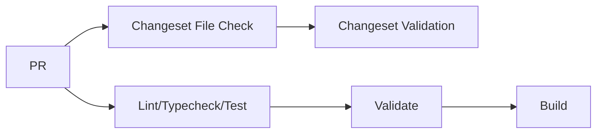

# Publishing

This guide covers the pull request process and release procedures for the design token package.

## Before Opening a PR

- [ ] Run local checks:
    - `pnpm run lint && pnpm run typecheck && pnpm run test && pnpm run validate`
- [ ] Build and commit generated files (`src/generated/`)
    - `pnpm --filter=@designgreat/lib-design-token run build`
    - `git add ...` & `git commit ...`
- [ ] Update documentation (if needed)
- [ ] [Create changeset](/contributing/changeset-workflow)

---

## CI Pipeline

### On Every PR

| Step | Command | Purpose |
|------|---------|---------|
| Changeset File Check | `ls .changeset/*.md` | Ensures changeset file exists (fast fail) |
| Changeset Validation | `pnpm changeset status` | Validates changeset content |
| Install | `pnpm install` | Install dependencies |
| Lint | `pnpm run lint` | Code style checks |
| Typecheck | `pnpm run typecheck` | TypeScript validation |
| Test | `pnpm run test` | Run unit tests |
| Validate | `pnpm run validate` | Token structure validation |
| Build | `pnpm run build` | Compile and bundle |

📄 Workflow files: [check-code-quality.yml](https://github.com/graezykev/designgreat/blob/main/.github/workflows/check-code-quality.yml) · [check-changeset.yml](https://github.com/graezykev/designgreat/blob/main/.github/workflows/check-changeset.yml)

### On Merge to Main

📄 Workflow file: [version-publish-packages.yml](https://github.com/graezykev/designgreat/blob/main/.github/workflows/version-publish-packages.yml)

---

## Package Distribution

### Exports

| Export | Format | Description |
|--------|--------|-------------|
| `.` | ESM/CJS | Runtime helpers, theme utilities |
| `./css` | CSS | All theme variables |
| `./css/light` | CSS | Light theme only |
| `./css/dark` | CSS | Dark theme only |
| `./font` | Assets | Font files (WOFF2) |

### Published Files

- `dist/` — JS, CSS, fonts, and TypeScript definitions
- `README.md` — Package documentation

---

## Next Steps

- Learn the [Changeset Workflow](/contributing/changeset-workflow) for versioning
- Review [Testing & Validation](./testing-validation) for quality checks
- Check [Troubleshooting](./troubleshooting) for common issues

