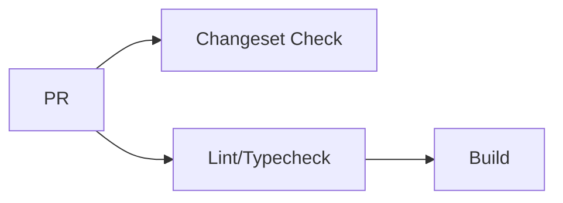
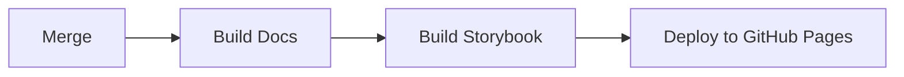

# Publishing

This guide covers the pull request process and deployment for the documentation site.

## Before Opening a PR

- [ ] Run local checks:
    - `pnpm run lint && pnpm run typecheck`
- [ ] Build and preview: 
    - `pnpm --filter @designgreat/docs-design-system build`
    - `pnpm --filter @designgreat/docs-design-system serve`
- [ ] Update documentation (if needed)
- [ ] [Create changeset](/contributing/changeset-workflow)

---

## CI Pipeline

### On Every PR

| Step | Command | Purpose |
|------|---------|---------|
| Changeset Check | — | Ensures changeset file exists |
| Install | `pnpm install` | Install dependencies |
| Lint | `pnpm run lint` | Code style checks |
| Typecheck | `pnpm run typecheck` | TypeScript validation |
| Build | `pnpm run build` | Build static site |

📄 Workflow files: [check-pull-request.yml](https://github.com/graezykev/designgreat/blob/main/.github/workflows/check-pull-request.yml) · [check-changeset.yml](https://github.com/graezykev/designgreat/blob/main/.github/workflows/check-changeset.yml)

### On Merge to Main

📄 Workflow file: [deploy-docs-storybook-gh-pages.yml](https://github.com/graezykev/designgreat/blob/main/.github/workflows/deploy-docs-storybook-gh-pages.yml)

---

## Deployment

The documentation site is automatically deployed to GitHub Pages.

### What Gets Deployed

| Site | URL | Source |
|------|-----|--------|
| Documentation | `/designgreat/` | This package |
| Storybook | `/designgreat/storybook/` | lib-web-component |

### Deployment Features

- **Automated builds** — Triggers after merge to main
- **Smart change detection** — Only rebuilds when necessary
- **Unified deployment** — Deploys with Storybook to prevent race conditions
- **Preservation strategy** — Maintains existing content when only one site changes

### Manual Deployment

Manual deployment is not typically needed. If required, see the [workflow file](https://github.com/graezykev/designgreat/blob/main/.github/workflows/deploy-docs-storybook-gh-pages.yml).

---

## Next Steps

- Review [Quality Checks](./quality) for linting and type checking
- Check [Writing Docs](./writing-docs) for content guidelines
- See [Features](./features) for advanced customizations

