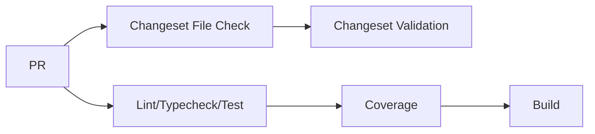
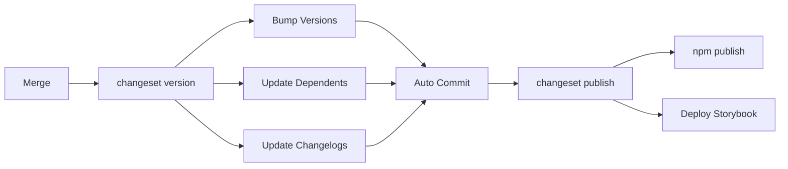

# Publishing

This guide covers the pull request process, release procedures, and package distribution for the component library.

## Before Opening a PR

- [ ] Build without errors:
    - `pnpm --filter=@designgreat/lib-web-component build`
- [ ] Run local checks:
    - `pnpm run lint && pnpm run typecheck && pnpm run test && pnpm run coverage`
- [ ] Update documentation (if needed)
- [ ] [Create changeset](/contributing/changeset-workflow)

---

## CI Pipeline

### On Every PR

| Step | Command | Purpose |
|------|---------|---------|
| Changeset File Check | `ls .changeset/*.md` | Ensures changeset file exists (fast fail) |
| Changeset Validation | `pnpm changeset status` | Validates changeset content |
| Install | `pnpm install` | Install dependencies |
| Lint | `pnpm run lint` | Code style checks |
| Typecheck | `pnpm run typecheck` | TypeScript validation |
| Test | `pnpm run test` | Run unit tests |
| Coverage | `pnpm run coverage` | Generate coverage report |
| Build | `pnpm run build` | Compile, bundle, and build Storybook |

📄 Workflow files: [check-code-quality.yml](https://github.com/graezykev/designgreat/blob/main/.github/workflows/check-code-quality.yml) · [check-changeset.yml](https://github.com/graezykev/designgreat/blob/main/.github/workflows/check-changeset.yml)

### On Merge to Main

📄 Workflow file: [version-publish-packages.yml](https://github.com/graezykev/designgreat/blob/main/.github/workflows/version-publish-packages.yml)

---

## Package Distribution

### Exports

| Export | Format | Description |
|--------|--------|-------------|
| `.` | ESM/CJS | All React components |
| `./dist/lib-web-component.css` | CSS | Complete style bundle |

### Published Files

- `dist/` — JS, CSS, and TypeScript definitions
- `README.md` — Package documentation

**Not published:** Source files, Storybook, tests, dev configs

---

## Next Steps

- Learn the [Changeset Workflow](/contributing/changeset-workflow) for versioning
- Review [Architecture](./architecture) for package structure
- See [Testing](./testing) for quality checks
- Check [Troubleshooting](./troubleshooting) for common issues
