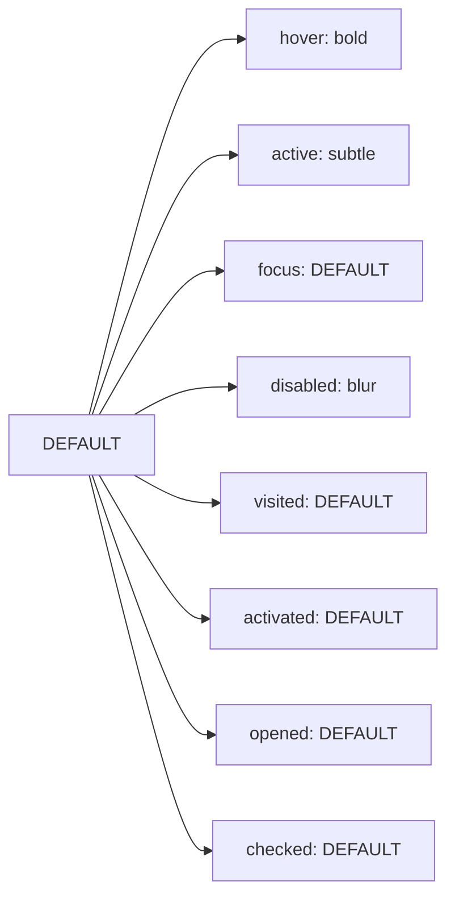

import CopyableCode from '@site/src/components/CopyableCode';

# Primary & Brand Colors

Primary colors (also known as brand colors) are the most prominent colors in your application, representing your brand identity and primary interactive elements. They are **theme-aware** and reference the blue accent color by default.

## Overview

Primary colors are used for:
- Primary call-to-action buttons
- Links and interactive elements
- Active/selected states
- Brand elements and hero sections
- Navigation highlights

### Key Characteristics

- **Theme-aware**: Automatically adjust for light/dark themes
- **Reference blue accent**: Default to `color.accent.blue.*`
- **Emphasis levels**: Provide shades for different emphasis
- **State-specific**: Include variants for interactive states
- **Customizable**: Can be remapped to different accent colors per theme

## Brand Color Alias

The `color.brand` token is a simple alias to the primary color:

|  | Token | CSS Variable | Reference | Use Case |
|--|-------|--------------|-----------|-------------|
| <div className="color-demo" style={{backgroundColor: 'var(--dg-color-brand)'}}></div> | <CopyableCode>color.brand</CopyableCode> | <CopyableCode>--dg-color-brand</CopyableCode> | `{color.primary.DEFAULT}` | Main brand color |

:::info
`color.brand` and `color.primary.DEFAULT` are identical. Use `color.brand` for brand identity elements and `color.primary.*` for interactive UI components.
:::

## Primary Color Emphasis Levels

Primary colors provide multiple emphasis levels for different visual weights and contexts.

### Emphasis Scale

|  | Token | CSS Variable | Reference | Alpha | Use Case |
|--|-------|--------------|-----------|-------|----------|
| <div className="color-demo" style={{backgroundColor: 'var(--dg-color-primary-bold)'}}></div> | <CopyableCode>color.primary.bold</CopyableCode> | <CopyableCode>--dg-color-primary-bold</CopyableCode> | `{color.accent.blue.bold}` | - | Hover states, high emphasis |
| <div className="color-demo" style={{backgroundColor: 'var(--dg-color-primary-default)'}}></div> | <CopyableCode bold>color.primary.DEFAULT</CopyableCode> | <CopyableCode>--dg-color-primary-default</CopyableCode> | `{color.accent.blue.DEFAULT}` | - | Default primary color |
| <div className="color-demo" style={{backgroundColor: 'var(--dg-color-primary-subtle)'}}></div> | <CopyableCode>color.primary.subtle</CopyableCode> | <CopyableCode>--dg-color-primary-subtle</CopyableCode> | `{color.accent.blue.subtle}` | - | Active/pressed states |
| <div className="color-demo" style={{backgroundColor: 'var(--dg-color-primary-subtler)'}}></div> | <CopyableCode>color.primary.subtler</CopyableCode> | <CopyableCode>--dg-color-primary-subtler</CopyableCode> | `{color.accent.blue.subtler}` | - | Backgrounds, lighter states |
| <div className="color-demo" style={{backgroundColor: 'var(--dg-color-primary-blur)'}}></div> | <CopyableCode>color.primary.blur</CopyableCode> | <CopyableCode>--dg-color-primary-blur</CopyableCode> | `{color.accent.blue.subtlest}` | 70% | Disabled states, blur effects |

## Interactive State Colors

Primary colors include specific tokens for common interactive states, making it easy to apply consistent behavior across components.

### State-Specific Tokens

|  | State | Token | CSS Variable | Reference | Use Case |
|--|-------|-------|--------------|---------|----------|
| <div className="color-demo" style={{backgroundColor: 'var(--dg-color-primary-visited-default)'}}></div> | **Visited** | <CopyableCode bold>color.primary.visited.DEFAULT</CopyableCode> | <CopyableCode>--dg-color-primary-visited-default</CopyableCode> | `{color.primary.DEFAULT}` | Visited links |
| <div className="color-demo" style={{backgroundColor: 'var(--dg-color-primary-hover-default)'}}></div> | **Hover** | <CopyableCode bold>color.primary.hover.DEFAULT</CopyableCode> | <CopyableCode>--dg-color-primary-hover-default</CopyableCode> | `{color.primary.bold}` | Hover state for buttons/links |
| <div className="color-demo" style={{backgroundColor: 'var(--dg-color-primary-focus-default)'}}></div> | **Focus** | <CopyableCode bold>color.primary.focus.DEFAULT</CopyableCode> | <CopyableCode>--dg-color-primary-focus-default</CopyableCode> | `{color.primary.DEFAULT}` | Focus state color |
| <div className="color-demo" style={{backgroundColor: 'var(--dg-color-primary-focus-shadow)'}}></div> | **Focus** | <CopyableCode>color.primary.focus.shadow</CopyableCode> | <CopyableCode>--dg-color-primary-focus-shadow</CopyableCode> | `{color.primary.blur}` | Focus ring/shadow color |
| <div className="color-demo" style={{backgroundColor: 'var(--dg-color-primary-active-default)'}}></div> | **Active** | <CopyableCode bold>color.primary.active.DEFAULT</CopyableCode> | <CopyableCode>--dg-color-primary-active-default</CopyableCode> | `{color.primary.subtle}` | Active/pressed state |
| <div className="color-demo" style={{backgroundColor: 'var(--dg-color-primary-disabled-default)'}}></div> | **Disabled** | <CopyableCode bold>color.primary.disabled.DEFAULT</CopyableCode> | <CopyableCode>--dg-color-primary-disabled-default</CopyableCode> | `{color.primary.blur}` | Disabled state |
| <div className="color-demo" style={{backgroundColor: 'var(--dg-color-primary-activated-default)'}}></div> | **Activated** | <CopyableCode bold>color.primary.activated.DEFAULT</CopyableCode> | <CopyableCode>--dg-color-primary-activated-default</CopyableCode> | `{color.primary.DEFAULT}` | Toggle activated color |
| <div className="color-demo" style={{backgroundColor: 'var(--dg-color-primary-activated-bg)'}}></div> | **Activated** | <CopyableCode>color.primary.activated.bg</CopyableCode> | <CopyableCode>--dg-color-primary-activated-bg</CopyableCode> | `{color.primary.blur}` | Toggle activated background |
| <div className="color-demo" style={{backgroundColor: 'var(--dg-color-primary-opened-default)'}}></div> | **Opened** | <CopyableCode bold>color.primary.opened.DEFAULT</CopyableCode> | <CopyableCode>--dg-color-primary-opened-default</CopyableCode> | `{color.primary.DEFAULT}` | Dropdown opened color |
| <div className="color-demo" style={{backgroundColor: 'var(--dg-color-primary-opened-bg)'}}></div> | **Opened** | <CopyableCode>color.primary.opened.bg</CopyableCode> | <CopyableCode>--dg-color-primary-opened-bg</CopyableCode> | `{color.primary.blur}` | Dropdown opened background |
| <div className="color-demo" style={{backgroundColor: 'var(--dg-color-primary-checked-default)'}}></div> | **Checked** | <CopyableCode bold>color.primary.checked.DEFAULT</CopyableCode> | <CopyableCode>--dg-color-primary-checked-default</CopyableCode> | `{color.primary.DEFAULT}` | Checkbox/radio checked |

### State Color Relationships



## Usage Examples

### Button States

```css
/* Primary button */
.button-primary {
  background-color: var(--dg-color-primary-default);
  color: white;
}

.button-primary:hover {
  background-color: var(--dg-color-primary-hover-default);
  /* or directly: var(--dg-color-primary-bold) */
}

.button-primary:active {
  background-color: var(--dg-color-primary-active-default);
  /* or directly: var(--dg-color-primary-subtle) */
}

.button-primary:focus {
  outline: 2px solid var(--dg-color-primary-focus-default);
  box-shadow: 0 0 0 4px var(--dg-color-primary-focus-shadow);
}

.button-primary:disabled {
  background-color: var(--dg-color-primary-disabled-default);
  opacity: 0.6;
}
```

### Link States

```css
/* Link styling */
a {
  color: var(--dg-color-primary-default);
}

a:visited {
  color: var(--dg-color-primary-visited-default);
}

a:hover {
  color: var(--dg-color-primary-hover-default);
}

a:active {
  color: var(--dg-color-primary-active-default);
}
```

### Toggle/Checkbox States

```css
/* Toggle switch */
.toggle-switch.checked {
  background-color: var(--dg-color-primary-checked-default);
}

.toggle-switch.checked .toggle-handle {
  background-color: white;
}
```

### Dropdown States

```css
/* Dropdown trigger */
.dropdown-trigger[aria-expanded="true"] {
  background-color: var(--dg-color-primary-opened-bg);
  color: var(--dg-color-primary-opened-default);
}
```

### TypeScript/JavaScript Usage

```typescript
import { tokens } from '@designgreat/lib-web-ui-design-token'

// Component styling
const buttonStyles = {
  backgroundColor: tokens.color.primary.DEFAULT,
  '&:hover': {
    backgroundColor: tokens.color.primary.hover.DEFAULT
  },
  '&:active': {
    backgroundColor: tokens.color.primary.active.DEFAULT
  }
}
```

## Theming Primary Colors

### Default Mapping

By default, primary colors reference the blue accent color:

```javascript
primary.DEFAULT → {color.accent.blue.DEFAULT}
primary.bold   → {color.accent.blue.bold}
primary.subtle → {color.accent.blue.subtle}
```

### Custom Theme Mapping

You can create themes that map primary colors to different accent colors:

```javascript
// Example: Theme with teal primary colors
{
  color: {
    primary: {
      DEFAULT: { value: '{color.accent.teal.DEFAULT}' },
      bold: { value: '{color.accent.teal.bold}' },
      subtle: { value: '{color.accent.teal.subtle}' }
      // ... other variants
    }
  }
}
```

This allows you to:
- Create brand-specific themes
- Support multiple brands in one application
- A/B test different color schemes
- Provide theme customization to users

## Usage Guidelines

### ✅ Do

- Use `color.primary.*` for all primary call-to-action elements
- Use state-specific tokens (hover, active, focus) for consistent interactions
- Use `color.brand` for brand logo or identity elements
- Rely on the emphasis scale for visual hierarchy
- Test contrast in both light and dark themes

### ❌ Don't

- Mix primary colors with other semantic colors for primary actions
- Override state colors with custom values (use the provided state tokens)
- Use primary colors for non-interactive decorations
- Ignore the emphasis scale and create custom shades

## Accessibility

### Contrast Requirements

Primary colors should meet WCAG AA standards:
- **Text on primary backgrounds**: Minimum 4.5:1 contrast ratio
- **Interactive elements**: Minimum 3:1 contrast ratio with adjacent colors

### Focus Indicators

Always provide visible focus indicators using:
- `color.primary.focus.DEFAULT` for focus outline color
- `color.primary.focus.shadow` for focus ring/shadow

```css
/* Accessible focus indicator */
.interactive-element:focus {
  outline: 2px solid var(--dg-color-primary-focus-default);
  outline-offset: 2px;
  box-shadow: 0 0 0 4px var(--dg-color-primary-focus-shadow);
}
```

### Disabled States

Ensure disabled states are visually distinct:
- Use `color.primary.disabled.DEFAULT` for disabled backgrounds
- Reduce opacity or add additional visual cues
- Remove interactive cursors (cursor: not-allowed)

## Complete Token Reference

### All Primary Tokens

| Category |  | Token | CSS Variable | Reference | Use Case |
|----------|--|-------|--------------|-----------|-------------|
| **Emphasis** | <div className="color-demo" style={{backgroundColor: 'var(--dg-color-primary-bold)'}}></div> | <CopyableCode>color.primary.bold</CopyableCode> | <CopyableCode>--dg-color-primary-bold</CopyableCode> | `{color.accent.blue.bold}` | Bold emphasis |
| | <div className="color-demo" style={{backgroundColor: 'var(--dg-color-primary-default)'}}></div> | <CopyableCode bold>color.primary.DEFAULT</CopyableCode> | <CopyableCode>--dg-color-primary-default</CopyableCode> | `{color.accent.blue.DEFAULT}` | Base primary color |
| | <div className="color-demo" style={{backgroundColor: 'var(--dg-color-primary-subtle)'}}></div> | <CopyableCode>color.primary.subtle</CopyableCode> | <CopyableCode>--dg-color-primary-subtle</CopyableCode> | `{color.accent.blue.subtle}` | Subtle emphasis |
| | <div className="color-demo" style={{backgroundColor: 'var(--dg-color-primary-subtler)'}}></div> | <CopyableCode>color.primary.subtler</CopyableCode> | <CopyableCode>--dg-color-primary-subtler</CopyableCode> | `{color.accent.blue.subtler}` | More subtle emphasis |
| | <div className="color-demo" style={{backgroundColor: 'var(--dg-color-primary-blur)'}}></div> | <CopyableCode>color.primary.blur</CopyableCode> | <CopyableCode>--dg-color-primary-blur</CopyableCode> | `{color.accent.blue.subtlest}` | Blur/disabled (70% opacity) |
| **Interactive** | <div className="color-demo" style={{backgroundColor: 'var(--dg-color-primary-visited-default)'}}></div> | <CopyableCode bold>color.primary.visited.DEFAULT</CopyableCode> | <CopyableCode>--dg-color-primary-visited-default</CopyableCode> | `{color.primary.DEFAULT}` | Visited links |
| | <div className="color-demo" style={{backgroundColor: 'var(--dg-color-primary-hover-default)'}}></div> | <CopyableCode bold>color.primary.hover.DEFAULT</CopyableCode> | <CopyableCode>--dg-color-primary-hover-default</CopyableCode> | `{color.primary.bold}` | Hover state |
| | <div className="color-demo" style={{backgroundColor: 'var(--dg-color-primary-focus-default)'}}></div> | <CopyableCode bold>color.primary.focus.DEFAULT</CopyableCode> | <CopyableCode>--dg-color-primary-focus-default</CopyableCode> | `{color.primary.DEFAULT}` | Focus color |
| | <div className="color-demo" style={{backgroundColor: 'var(--dg-color-primary-focus-shadow)'}}></div> | <CopyableCode>color.primary.focus.shadow</CopyableCode> | <CopyableCode>--dg-color-primary-focus-shadow</CopyableCode> | `{color.primary.blur}` | Focus shadow |
| | <div className="color-demo" style={{backgroundColor: 'var(--dg-color-primary-active-default)'}}></div> | <CopyableCode bold>color.primary.active.DEFAULT</CopyableCode> | <CopyableCode>--dg-color-primary-active-default</CopyableCode> | `{color.primary.subtle}` | Active/pressed |
| | <div className="color-demo" style={{backgroundColor: 'var(--dg-color-primary-disabled-default)'}}></div> | <CopyableCode bold>color.primary.disabled.DEFAULT</CopyableCode> | <CopyableCode>--dg-color-primary-disabled-default</CopyableCode> | `{color.primary.blur}` | Disabled state |
| **Component** | <div className="color-demo" style={{backgroundColor: 'var(--dg-color-primary-activated-default)'}}></div> | <CopyableCode bold>color.primary.activated.DEFAULT</CopyableCode> | <CopyableCode>--dg-color-primary-activated-default</CopyableCode> | `{color.primary.DEFAULT}` | Activated toggle |
| | <div className="color-demo" style={{backgroundColor: 'var(--dg-color-primary-activated-bg)'}}></div> | <CopyableCode>color.primary.activated.bg</CopyableCode> | <CopyableCode>--dg-color-primary-activated-bg</CopyableCode> | `{color.primary.blur}` | Activated background |
| | <div className="color-demo" style={{backgroundColor: 'var(--dg-color-primary-opened-default)'}}></div> | <CopyableCode bold>color.primary.opened.DEFAULT</CopyableCode> | <CopyableCode>--dg-color-primary-opened-default</CopyableCode> | `{color.primary.DEFAULT}` | Opened dropdown |
| | <div className="color-demo" style={{backgroundColor: 'var(--dg-color-primary-opened-bg)'}}></div> | <CopyableCode>color.primary.opened.bg</CopyableCode> | <CopyableCode>--dg-color-primary-opened-bg</CopyableCode> | `{color.primary.blur}` | Opened background |
| | <div className="color-demo" style={{backgroundColor: 'var(--dg-color-primary-checked-default)'}}></div> | <CopyableCode bold>color.primary.checked.DEFAULT</CopyableCode> | <CopyableCode>--dg-color-primary-checked-default</CopyableCode> | `{color.primary.DEFAULT}` | Checked state |
| **Alias** | <div className="color-demo" style={{backgroundColor: 'var(--dg-color-brand)'}}></div> | <CopyableCode>color.brand</CopyableCode> | <CopyableCode>--dg-color-brand</CopyableCode> | `{color.primary.DEFAULT}` | Brand alias |

## Technical Details

### File Structure

```
packages/lib-web-ui-design-token/src/tokens/color/
  ├── primary.js  # Primary color definitions
  └── brand.js    # Brand alias to primary
```

### Token Structure

```javascript
// primary.js
{
  color: {
    primary: {
      DEFAULT: { value: '{color.accent.blue.DEFAULT}', type: 'color' },
      bold: { value: '{color.accent.blue.bold}', type: 'color' },
      subtle: { value: '{color.accent.blue.subtle}', type: 'color' },
      blur: { 
        value: '{color.accent.blue.subtlest}',
        attributes: { alpha: 0.7 },
        type: 'color'
      },
      hover: {
        DEFAULT: { value: '{color.primary.bold}', type: 'color' }
      },
      // ... more state variants
    }
  }
}
```

## Related Topics

- [Accent Colors](./accent-colors) - Understanding blue accent colors
- [Secondary, Tertiary, Quartus Colors](./secondary-tertiary-quartus) - Additional action colors
- [Semantic Colors](./semantic-colors) - Semantic meanings vs primary actions
- [Theming](/design-token/guides/theming) - Theming primary colors

