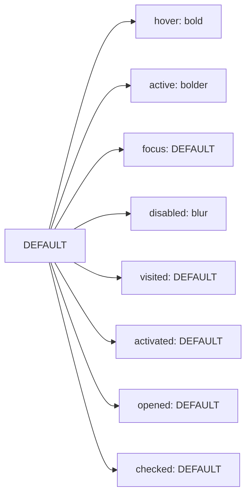

import CopyableCode from '@site/src/components/CopyableCode'

# Primary & Brand Colors

Primary colors (also known as brand colors) are the most prominent colors in your application, representing your brand identity and primary interactive elements. They are **theme-aware** and reference the blue accent color by default.

## Overview

Primary colors are used for:

- Primary call-to-action buttons
- Links and interactive elements
- Active/selected states
- Brand elements and hero sections
- Navigation highlights

### Key Characteristics

- **Theme-aware**: Automatically adjust for light/dark themes
- **Reference blue accent**: Default to `color.accent.blue.*`
- **Emphasis levels**: Provide shades for different emphasis
- **State-specific**: Include variants for interactive states
- **Customizable**: Can be remapped to different accent colors per theme

## Brand Color Alias

The `color.brand` token is a simple alias to the primary color:

|                                                                                       | Token                                    | CSS Variable                                  | Reference                 | Use Case         |
| ------------------------------------------------------------------------------------- | ---------------------------------------- | --------------------------------------------- | ------------------------- | ---------------- |
| <div className="color-demo" style={{backgroundColor: 'var(--dg-color-brand)'}}></div> | <CopyableCode>color.brand</CopyableCode> | <CopyableCode>--dg-color-brand</CopyableCode> | `{color.primary.DEFAULT}` | Main brand color |

:::info
`color.brand` and `color.primary.DEFAULT` are identical. Use `color.brand` for brand identity elements and `color.primary.*` for interactive UI components.
:::

## Primary Color Emphasis Levels

Primary colors provide multiple emphasis levels for different visual weights and contexts.

### Emphasis Scale

|                                                                                                 | Token                                                   | CSS Variable                                            | Reference                      | Alpha | Use Case                                  |
| ----------------------------------------------------------------------------------------------- | ------------------------------------------------------- | ------------------------------------------------------- | ------------------------------ | ----- | ----------------------------------------- |
| <div className="color-demo" style={{backgroundColor: 'var(--dg-color-primary-bolder)'}}></div>  | <CopyableCode>color.primary.bolder</CopyableCode>       | <CopyableCode>--dg-color-primary-bolder</CopyableCode>  | `{color.accent.blue.bolder}`   | -     | Active/pressed states (darker than hover) |
| <div className="color-demo" style={{backgroundColor: 'var(--dg-color-primary-bold)'}}></div>    | <CopyableCode>color.primary.bold</CopyableCode>         | <CopyableCode>--dg-color-primary-bold</CopyableCode>    | `{color.accent.blue.bold}`     | -     | Hover states, high emphasis               |
| <div className="color-demo" style={{backgroundColor: 'var(--dg-color-primary-default)'}}></div> | <CopyableCode bold>color.primary.DEFAULT</CopyableCode> | <CopyableCode>--dg-color-primary-default</CopyableCode> | `{color.accent.blue.DEFAULT}`  | -     | Default primary color                     |
| <div className="color-demo" style={{backgroundColor: 'var(--dg-color-primary-subtle)'}}></div>  | <CopyableCode>color.primary.subtle</CopyableCode>       | <CopyableCode>--dg-color-primary-subtle</CopyableCode>  | `{color.accent.blue.subtle}`   | -     | Subtle emphasis states                    |
| <div className="color-demo" style={{backgroundColor: 'var(--dg-color-primary-subtler)'}}></div> | <CopyableCode>color.primary.subtler</CopyableCode>      | <CopyableCode>--dg-color-primary-subtler</CopyableCode> | `{color.accent.blue.subtler}`  | -     | Backgrounds, lighter states               |
| <div className="color-demo" style={{backgroundColor: 'var(--dg-color-primary-blur)'}}></div>    | <CopyableCode>color.primary.blur</CopyableCode>         | <CopyableCode>--dg-color-primary-blur</CopyableCode>    | `{color.accent.blue.subtlest}` | 70%   | Disabled states, blur effects             |

## Interactive State Colors

Primary colors include specific tokens for common interactive states, making it easy to apply consistent behavior across components.

### State-Specific Tokens

|                                                                                                           | State         | Token                                                             | CSS Variable                                                      | Reference                 | Use Case                                 |
| --------------------------------------------------------------------------------------------------------- | ------------- | ----------------------------------------------------------------- | ----------------------------------------------------------------- | ------------------------- | ---------------------------------------- |
| <div className="color-demo" style={{backgroundColor: 'var(--dg-color-primary-visited-default)'}}></div>   | **Visited**   | <CopyableCode bold>color.primary.visited.DEFAULT</CopyableCode>   | <CopyableCode>--dg-color-primary-visited-default</CopyableCode>   | `{color.primary.DEFAULT}` | Visited links                            |
| <div className="color-demo" style={{backgroundColor: 'var(--dg-color-primary-hover-default)'}}></div>     | **Hover**     | <CopyableCode bold>color.primary.hover.DEFAULT</CopyableCode>     | <CopyableCode>--dg-color-primary-hover-default</CopyableCode>     | `{color.primary.bold}`    | Hover state for buttons/links            |
| <div className="color-demo" style={{backgroundColor: 'var(--dg-color-primary-focus-default)'}}></div>     | **Focus**     | <CopyableCode bold>color.primary.focus.DEFAULT</CopyableCode>     | <CopyableCode>--dg-color-primary-focus-default</CopyableCode>     | `{color.primary.DEFAULT}` | Focus state color                        |
| <div className="color-demo" style={{backgroundColor: 'var(--dg-color-primary-focus-shadow)'}}></div>      | **Focus**     | <CopyableCode>color.primary.focus.shadow</CopyableCode>           | <CopyableCode>--dg-color-primary-focus-shadow</CopyableCode>      | `{color.primary.blur}`    | Focus ring/shadow color                  |
| <div className="color-demo" style={{backgroundColor: 'var(--dg-color-primary-active-default)'}}></div>    | **Active**    | <CopyableCode bold>color.primary.active.DEFAULT</CopyableCode>    | <CopyableCode>--dg-color-primary-active-default</CopyableCode>    | `{color.primary.bolder}`  | Active/pressed state (darker than hover) |
| <div className="color-demo" style={{backgroundColor: 'var(--dg-color-primary-disabled-default)'}}></div>  | **Disabled**  | <CopyableCode bold>color.primary.disabled.DEFAULT</CopyableCode>  | <CopyableCode>--dg-color-primary-disabled-default</CopyableCode>  | `{color.primary.blur}`    | Disabled state                           |
| <div className="color-demo" style={{backgroundColor: 'var(--dg-color-primary-activated-default)'}}></div> | **Activated** | <CopyableCode bold>color.primary.activated.DEFAULT</CopyableCode> | <CopyableCode>--dg-color-primary-activated-default</CopyableCode> | `{color.primary.DEFAULT}` | Toggle activated color                   |
| <div className="color-demo" style={{backgroundColor: 'var(--dg-color-primary-activated-bg)'}}></div>      | **Activated** | <CopyableCode>color.primary.activated.bg</CopyableCode>           | <CopyableCode>--dg-color-primary-activated-bg</CopyableCode>      | `{color.primary.blur}`    | Toggle activated background              |
| <div className="color-demo" style={{backgroundColor: 'var(--dg-color-primary-opened-default)'}}></div>    | **Opened**    | <CopyableCode bold>color.primary.opened.DEFAULT</CopyableCode>    | <CopyableCode>--dg-color-primary-opened-default</CopyableCode>    | `{color.primary.DEFAULT}` | Dropdown opened color                    |
| <div className="color-demo" style={{backgroundColor: 'var(--dg-color-primary-opened-bg)'}}></div>         | **Opened**    | <CopyableCode>color.primary.opened.bg</CopyableCode>              | <CopyableCode>--dg-color-primary-opened-bg</CopyableCode>         | `{color.primary.blur}`    | Dropdown opened background               |
| <div className="color-demo" style={{backgroundColor: 'var(--dg-color-primary-checked-default)'}}></div>   | **Checked**   | <CopyableCode bold>color.primary.checked.DEFAULT</CopyableCode>   | <CopyableCode>--dg-color-primary-checked-default</CopyableCode>   | `{color.primary.DEFAULT}` | Checkbox/radio checked                   |

### State Color Relationships



## Usage Examples

These primary colors are used throughout the design system. See live demos in these pages:

### Buttons

Primary colors power the main button styles with all interactive states.

→ **See live demos**: [Button State Patterns](./shortcuts/interactive-state#button-interaction-colors) (Primary, Outline, Ghost buttons)

```css
.dg-btn-primary {
  background-color: var(--dg-color-primary-default);
  color: var(--dg-color-text-inverse);
}

.dg-btn-primary:hover {
  background-color: var(--dg-color-primary-hover-default);
}

.dg-btn-primary:focus {
  box-shadow: 0 0 0 4px var(--dg-color-primary-focus-shadow);
}
```

### Outline Buttons

The standard `.dg-btn-outline` component uses primary colors by default.

→ **See live demos**: [Outline Buttons](./shortcuts/interactive-state#outline-buttons)

```css
.dg-btn-outline {
  background-color: var(--dg-color-background-button-outline-default);
  color: var(--dg-color-text-button-outline-default);
  border: var(--dg-border-width-thin) solid var(--dg-color-border-button-outline-default);
}

.dg-btn-outline:hover,
.dg-btn-outline--hover {
  background-color: var(--dg-color-background-button-outline-interaction-hover);
  border-color: var(--dg-color-border-button-outline-interaction-hover);
}
```

### Links

Primary colors power link appearance through the link shortcut tokens, which reference primary colors.

→ **See live demos**: [Link State Patterns](./shortcuts/interactive-state#link-interaction-colors)

```css
.dg-link {
  color: var(--dg-color-text-link-default);
}

.dg-link:hover {
  color: var(--dg-color-text-link-interaction-hover);
}

.dg-link--hover,
.dg-link--hover:hover {
  color: var(--dg-color-text-link-interaction-hover);
}

.dg-link:visited {
  color: var(--dg-color-text-link-interaction-visited);
}

.dg-link--visited,
.dg-link--visited:visited {
  color: var(--dg-color-text-link-interaction-visited);
}
```

### Form Controls

Primary colors are used for checkboxes, toggles, and input focus states through component shortcut tokens.

→ **See live demos**: [Toggle/Checkbox Patterns](./shortcuts/interactive-state#checkbox--radio-colors) | [Input Focus States](./shortcuts/interactive-state#input-interaction-colors)

```css
.dg-checkbox-checked {
  background-color: var(--dg-color-background-checkbox-state-checked);
  border-color: var(--dg-color-border-checkbox-state-checked);
}

.dg-input:focus,
.dg-input.dg-input-focus {
  border-color: var(--dg-color-border-input-interaction-focus);
  box-shadow: var(--dg-shadow-focus);
}
```

### Focus Shadows

The `color.primary.focus.shadow` token powers the focus ring effect. The `shadow.focus` compound token combines primary color with proper spacing for accessible focus indicators.

→ **See live demos**: [Focus Shadow](./shortcuts/shadow#focus-shadow) | [Focus Indicators](./shortcuts/shadow#focus-indicators)

```css
.dg-focus-card:focus,
.dg-focus-card-focused {
  box-shadow: var(--dg-shadow-focus);
  border-color: var(--dg-color-primary-default);
  outline: none;
}
```

### Gradients

Primary colors are combined in gradient tokens for hero sections and buttons.

→ **See live demos**: [Gradient Buttons](../effects/gradients#interactive-gradient-buttons) | [Hero Gradients](../effects/gradients#animated-hero-gradient)

```css
.dg-btn-gradient-primary {
  background: var(--dg-gradient-brand-primary);
  color: var(--dg-color-text-inverse);
}

.dg-btn-gradient-primary:hover {
  filter: brightness(1.1);
  transform: translateY(-1px);
  box-shadow: var(--dg-shadow-elevation-sm);
}
```

### TypeScript/JavaScript

```typescript
import { tokens } from '@designgreat/lib-design-token'

const buttonStyles = {
  backgroundColor: tokens.color.primary.DEFAULT,
  '&:hover': {
    backgroundColor: tokens.color.primary.hover.DEFAULT
  }
}
```

## Theming Primary Colors

### Default Mapping

By default, primary colors reference the blue accent color:

```javascript
primary.DEFAULT → {color.accent.blue.DEFAULT}
primary.bold   → {color.accent.blue.bold}
primary.subtle → {color.accent.blue.subtle}
```

### Custom Theme Mapping

You can create themes that map primary colors to different accent colors:

```javascript
// Example: Theme with teal primary colors
{
  color: {
    primary: {
      DEFAULT: { value: '{color.accent.teal.DEFAULT}' },
      bold: { value: '{color.accent.teal.bold}' },
      subtle: { value: '{color.accent.teal.subtle}' }
      // ... other variants
    }
  }
}
```

This allows you to:

- Create brand-specific themes
- Support multiple brands in one application
- A/B test different color schemes
- Provide theme customization to users

## Usage Guidelines

### ✅ Do

- Use `color.primary.*` for all primary call-to-action elements
- Use state-specific tokens (hover, active, focus) for consistent interactions
- Use `color.brand` for brand logo or identity elements
- Rely on the emphasis scale for visual hierarchy
- Test contrast in both light and dark themes

### ❌ Don't

- Mix primary colors with other semantic colors for primary actions
- Override state colors with custom values (use the provided state tokens)
- Use primary colors for non-interactive decorations
- Ignore the emphasis scale and create custom shades

## Accessibility

### Contrast Requirements

Primary colors should meet WCAG AA standards:

- **Text on primary backgrounds**: Minimum 4.5:1 contrast ratio
- **Interactive elements**: Minimum 3:1 contrast ratio with adjacent colors

### Focus Indicators

Always provide visible focus indicators using:

- `color.primary.focus.DEFAULT` for focus outline color
- `color.primary.focus.shadow` for focus ring/shadow

```css
/* Accessible focus indicator */
.interactive-element:focus {
  outline: 2px solid var(--dg-color-primary-focus-default);
  outline-offset: 2px;
  box-shadow: 0 0 0 4px var(--dg-color-primary-focus-shadow);
}
```

### Disabled States

Ensure disabled states are visually distinct:

- Use `color.primary.disabled.DEFAULT` for disabled backgrounds
- Reduce opacity or add additional visual cues
- Remove interactive cursors (cursor: not-allowed)

## Technical Details

### File Structure

```
packages/lib-design-token/src/tokens/color/
  ├── primary.js  # Primary color definitions
  └── brand.js    # Brand alias to primary
```

### Token Structure

```javascript
// primary.js
{
  color: {
    primary: {
      DEFAULT: { value: '{color.accent.blue.DEFAULT}', type: 'color' },
      bold: { value: '{color.accent.blue.bold}', type: 'color' },
      subtle: { value: '{color.accent.blue.subtle}', type: 'color' },
      blur: {
        value: '{color.accent.blue.subtlest}',
        attributes: { alpha: 0.7 },
        type: 'color'
      },
      hover: {
        DEFAULT: { value: '{color.primary.bold}', type: 'color' }
      },
      // ... more state variants
    }
  }
}
```

## Related

- [Interactive State Shortcuts](./shortcuts/interactive-state) - **Live demos** of buttons, links, inputs using primary colors
- [Shadow Shortcuts](./shortcuts/shadow) - Focus shadows and elevation using primary colors
- [Accent Colors](./accent-colors) - Understanding the blue accent colors that primary references
- [Secondary, Tertiary, Quartus Colors](./secondary-tertiary-quartus) - Additional action colors
- [Semantic Colors](./semantic-colors) - Semantic meanings vs primary actions
- [Gradients](../effects/gradients) - Gradient buttons and hero sections
