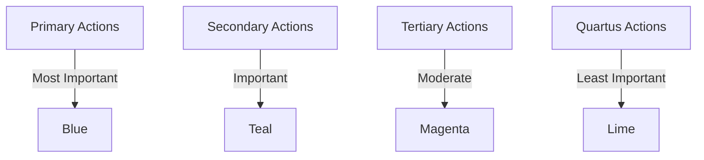

import CopyableCode from '@site/src/components/CopyableCode';

# Secondary, Tertiary & Quartus Colors

Beyond primary colors, the Design Great system provides three additional action color sets: **Secondary**, **Tertiary**, and **Quartus**. These colors provide alternative emphasis levels for actions and allow you to create visual hierarchy in complex interfaces.

## Overview

These color sets follow the same pattern as primary colors but reference different accent colors:

- **Secondary** → Teal accent color
- **Tertiary** → Magenta accent color
- **Quartus** → Lime accent color

### Key Characteristics

- **Theme-aware**: Automatically adjust for light/dark themes
- **Parallel structure**: Same emphasis levels as primary colors
- **Distinct identity**: Each has a unique accent color reference
- **Hierarchical**: Represent decreasing importance after primary

## Color Hierarchy



## Secondary Colors (Teal)

Secondary colors reference the **teal accent color** and are used for secondary actions and alternative call-to-actions.

### Secondary Emphasis Levels

|  | Token | CSS Variable | Reference | Alpha | Use Case |
|--|-------|--------------|-----------|-------|-------------|
| <div className="color-demo" style={{backgroundColor: 'var(--dg-color-secondary-bold)'}}></div> | <CopyableCode>color.secondary.bold</CopyableCode> | <CopyableCode>--dg-color-secondary-bold</CopyableCode> | `{color.accent.teal.bold}` | - | Hover state |
| <div className="color-demo" style={{backgroundColor: 'var(--dg-color-secondary-default)'}}></div> | <CopyableCode bold>color.secondary.DEFAULT</CopyableCode> | <CopyableCode>--dg-color-secondary-default</CopyableCode> | `{color.accent.teal.7}` | - | Default secondary |
| <div className="color-demo" style={{backgroundColor: 'var(--dg-color-secondary-subtle)'}}></div> | <CopyableCode>color.secondary.subtle</CopyableCode> | <CopyableCode>--dg-color-secondary-subtle</CopyableCode> | `{color.accent.teal.subtle}` | - | Active state |
| <div className="color-demo" style={{backgroundColor: 'var(--dg-color-secondary-subtler)'}}></div> | <CopyableCode>color.secondary.subtler</CopyableCode> | <CopyableCode>--dg-color-secondary-subtler</CopyableCode> | `{color.accent.teal.subtler}` | - | Background |
| <div className="color-demo" style={{backgroundColor: 'var(--dg-color-secondary-blur)'}}></div> | <CopyableCode>color.secondary.blur</CopyableCode> | <CopyableCode>--dg-color-secondary-blur</CopyableCode> | `{color.accent.teal.subtlest}` | 70% | Disabled |

:::info
Secondary colors do **not** include state-specific tokens (hover, active, focus, etc.) like primary colors. Use the emphasis levels directly for these states.
:::

## Tertiary Colors (Magenta)

Tertiary colors reference the **magenta accent color** and are used for tertiary actions and additional UI variations.

### Tertiary Emphasis Levels

|  | Token | CSS Variable | Reference | Alpha | Use Case |
|--|-------|--------------|-----------|-------|-------------|
| <div className="color-demo" style={{backgroundColor: 'var(--dg-color-tertiary-bold)'}}></div> | <CopyableCode>color.tertiary.bold</CopyableCode> | <CopyableCode>--dg-color-tertiary-bold</CopyableCode> | `{color.accent.magenta.bold}` | - | Hover state |
| <div className="color-demo" style={{backgroundColor: 'var(--dg-color-tertiary-default)'}}></div> | <CopyableCode bold>color.tertiary.DEFAULT</CopyableCode> | <CopyableCode>--dg-color-tertiary-default</CopyableCode> | `{color.accent.magenta.7}` | - | Default tertiary |
| <div className="color-demo" style={{backgroundColor: 'var(--dg-color-tertiary-subtle)'}}></div> | <CopyableCode>color.tertiary.subtle</CopyableCode> | <CopyableCode>--dg-color-tertiary-subtle</CopyableCode> | `{color.accent.magenta.subtle}` | - | Active state |
| <div className="color-demo" style={{backgroundColor: 'var(--dg-color-tertiary-subtler)'}}></div> | <CopyableCode>color.tertiary.subtler</CopyableCode> | <CopyableCode>--dg-color-tertiary-subtler</CopyableCode> | `{color.accent.magenta.subtler}` | - | Background |
| <div className="color-demo" style={{backgroundColor: 'var(--dg-color-tertiary-blur)'}}></div> | <CopyableCode>color.tertiary.blur</CopyableCode> | <CopyableCode>--dg-color-tertiary-blur</CopyableCode> | `{color.accent.magenta.subtlest}` | 70% | Disabled |

## Quartus Colors (Lime)

Quartus colors reference the **lime accent color** and are used for the lowest-priority action level or specialized contexts.

### Quartus Emphasis Levels

|  | Token | CSS Variable | Reference | Alpha | Use Case |
|--|-------|--------------|-----------|-------|-------------|
| <div className="color-demo" style={{backgroundColor: 'var(--dg-color-quartus-bold)'}}></div> | <CopyableCode>color.quartus.bold</CopyableCode> | <CopyableCode>--dg-color-quartus-bold</CopyableCode> | `{color.accent.lime.bold}` | - | Hover state |
| <div className="color-demo" style={{backgroundColor: 'var(--dg-color-quartus-default)'}}></div> | <CopyableCode bold>color.quartus.DEFAULT</CopyableCode> | <CopyableCode>--dg-color-quartus-default</CopyableCode> | `{color.accent.lime.7}` | - | Default quartus |
| <div className="color-demo" style={{backgroundColor: 'var(--dg-color-quartus-subtle)'}}></div> | <CopyableCode>color.quartus.subtle</CopyableCode> | <CopyableCode>--dg-color-quartus-subtle</CopyableCode> | `{color.accent.lime.subtle}` | - | Active state |
| <div className="color-demo" style={{backgroundColor: 'var(--dg-color-quartus-subtler)'}}></div> | <CopyableCode>color.quartus.subtler</CopyableCode> | <CopyableCode>--dg-color-quartus-subtler</CopyableCode> | `{color.accent.lime.subtler}` | - | Background |
| <div className="color-demo" style={{backgroundColor: 'var(--dg-color-quartus-blur)'}}></div> | <CopyableCode>color.quartus.blur</CopyableCode> | <CopyableCode>--dg-color-quartus-blur</CopyableCode> | `{color.accent.lime.subtlest}` | 70% | Disabled |

## Common Emphasis Structure

All three color sets (secondary, tertiary, quartus) share the same emphasis structure:

| Level | Use Case | Use Case |
|-------|-------------|----------|
| **bold** | Darker/stronger | Hover states, high emphasis |
| **DEFAULT** | Base color | Default button/element color |
| **subtle** | Lighter/softer | Active/pressed states |
| **subtler** | More subtle | Backgrounds, low emphasis |
| **blur** | Transparent | Disabled states |

## Usage Examples

These colors are used for action hierarchy throughout the design system. See live demos in these pages:

### Secondary Buttons

Secondary colors power alternative action buttons with full interactive states.

→ **See live demos**: [Secondary Button Patterns](./shortcuts/interactive-state#secondary-buttons)

```css
.button-secondary {
  background-color: var(--dg-color-secondary-default);
  color: var(--dg-color-text-inverse);
}

.button-secondary:hover {
  background-color: var(--dg-color-secondary-bold);
}

.button-secondary:active {
  background-color: var(--dg-color-secondary-subtle);
}

.button-secondary:disabled {
  background-color: var(--dg-color-secondary-blur);
  opacity: 0.6;
}
```

### Button Hierarchy

When you need multiple actions with visual hierarchy, combine primary, secondary, and neutral buttons.

→ **See live demos**: [Button Spacing Examples](../spacing/semantic-scales#flex-container-with-gap)

```css
/* Primary: most important */
.button-primary { background-color: var(--dg-color-primary-default); }

/* Secondary: important alternative */
.button-secondary { background-color: var(--dg-color-secondary-default); }

/* Neutral: dismissive action */
.button-neutral { background-color: var(--dg-color-background-bold); }
```

### Badges & Tags

Secondary and tertiary colors can be used for badges that indicate different priority levels.

→ **See live demos**: [Badge Components](./semantic-colors#badges-and-tags) | [Interactive Badges](./shortcuts/interactive-state#badge-and-tag-state-patterns)

```css
.badge-secondary {
  background-color: var(--dg-color-secondary-subtler);
  color: var(--dg-color-secondary-default);
}

.badge-tertiary {
  background-color: var(--dg-color-tertiary-subtler);
  color: var(--dg-color-tertiary-default);
}
```

### Outline Button Variants

Secondary colors work well for outline-style buttons as alternatives to primary outlines.

→ **See live demos**: [Outline Buttons](./shortcuts/interactive-state#outline-buttons) | [Border Button Examples](./shortcuts/border#buttons)

```css
.button-secondary-outline {
  background-color: transparent;
  border: 2px solid var(--dg-color-secondary-default);
  color: var(--dg-color-secondary-default);
}

.button-secondary-outline:hover {
  background-color: var(--dg-color-secondary-subtler);
  border-color: var(--dg-color-secondary-bold);
}
```

### TypeScript/JavaScript

```typescript
import { tokens } from '@designgreat/lib-design-token'

const buttonVariants = {
  primary: tokens.color.primary.DEFAULT,
  secondary: tokens.color.secondary.DEFAULT,
  tertiary: tokens.color.tertiary.DEFAULT,
  quartus: tokens.color.quartus.DEFAULT
}
```

## When to Use Each Color Set

### Primary (Blue)
- **Use for**: Most important actions, main CTAs, brand identity
- **Examples**: "Save", "Submit", "Buy Now", main navigation links

### Secondary (Teal)
- **Use for**: Important but not primary actions, alternative CTAs
- **Examples**: "Cancel", "Learn More", "Export", secondary navigation

### Tertiary (Magenta)
- **Use for**: Supporting actions, less common operations
- **Examples**: "Advanced Options", "Customize", "Filter", special features

### Quartus (Lime)
- **Use for**: Lowest priority actions, specialized contexts
- **Examples**: "Reset", "Clear", "Dismiss", auxiliary controls

## Visual Hierarchy Example

In a dialog with multiple actions:

```html
<dialog>
  <h2>Confirm Action</h2>
  <p>Are you sure you want to proceed?</p>
  
  <div class="actions">
    <!-- Primary: Most important -->
    <button class="button-primary">Confirm</button>
    
    <!-- Secondary: Alternative action -->
    <button class="button-secondary">Save Draft</button>
    
    <!-- Tertiary: Less common -->
    <button class="button-tertiary">Advanced Options</button>
    
    <!-- Quartus or neutral: Dismissive -->
    <button class="button-neutral">Cancel</button>
  </div>
</dialog>
```

## Usage Guidelines

### ✅ Do

- Use primary for the most important action
- Use secondary for important alternative actions
- Use tertiary and quartus sparingly for lower-priority actions
- Maintain consistent meaning across your application
- Apply the same state patterns (hover, active, disabled) to all variants

### ❌ Don't

- Use all four color sets in a single view (overwhelming)
- Interchange the meanings of these colors
- Use semantic colors (success, error, warning) for action hierarchy
- Create custom intermediate colors between these sets

## Accessibility Considerations

### Contrast

Ensure all text on colored backgrounds meets WCAG AA standards:
- Test contrast ratios in both light and dark themes
- Use white or dark text depending on background lightness
- Verify readability of disabled states

### Color Blindness

Do not rely solely on color to convey meaning:
- Pair colors with icons or text labels
- Use position and size to indicate hierarchy
- Provide additional context for color-blind users

### Focus Indicators

All interactive elements need visible focus states:

```css
.button-secondary:focus {
  outline: 2px solid var(--dg-color-secondary-default);
  outline-offset: 2px;
}
```

## Complete Token Reference

### All Secondary Tokens

| | Token | Reference | Alpha |
|--|-------|-----------|-------|
| <div className="color-demo" style={{backgroundColor: 'var(--dg-color-secondary-default)'}}></div> | <CopyableCode bold>color.secondary.DEFAULT</CopyableCode> | `{color.accent.teal.DEFAULT}` | - |
| <div className="color-demo" style={{backgroundColor: 'var(--dg-color-secondary-bold)'}}></div> | <CopyableCode>color.secondary.bold</CopyableCode> | `{color.accent.teal.bold}` | - |
| <div className="color-demo" style={{backgroundColor: 'var(--dg-color-secondary-subtle)'}}></div> | <CopyableCode>color.secondary.subtle</CopyableCode> | `{color.accent.teal.subtle}` | - |
| <div className="color-demo" style={{backgroundColor: 'var(--dg-color-secondary-subtler)'}}></div> | <CopyableCode>color.secondary.subtler</CopyableCode> | `{color.accent.teal.subtler}` | - |
| <div className="color-demo" style={{backgroundColor: 'var(--dg-color-secondary-blur)'}}></div> | <CopyableCode>color.secondary.blur</CopyableCode> | `{color.accent.teal.subtlest}` | 70% |

### All Tertiary Tokens

| | Token | Reference | Alpha |
|--|-------|-----------|-------|
| <div className="color-demo" style={{backgroundColor: 'var(--dg-color-tertiary-default)'}}></div> | <CopyableCode bold>color.tertiary.DEFAULT</CopyableCode> | `{color.accent.magenta.DEFAULT}` | - |
| <div className="color-demo" style={{backgroundColor: 'var(--dg-color-tertiary-bold)'}}></div> | <CopyableCode>color.tertiary.bold</CopyableCode> | `{color.accent.magenta.bold}` | - |
| <div className="color-demo" style={{backgroundColor: 'var(--dg-color-tertiary-subtle)'}}></div> | <CopyableCode>color.tertiary.subtle</CopyableCode> | `{color.accent.magenta.subtle}` | - |
| <div className="color-demo" style={{backgroundColor: 'var(--dg-color-tertiary-subtler)'}}></div> | <CopyableCode>color.tertiary.subtler</CopyableCode> | `{color.accent.magenta.subtler}` | - |
| <div className="color-demo" style={{backgroundColor: 'var(--dg-color-tertiary-blur)'}}></div> | <CopyableCode>color.tertiary.blur</CopyableCode> | `{color.accent.magenta.subtlest}` | 70% |

### All Quartus Tokens

| | Token | Reference | Alpha |
|--|-------|-----------|-------|
| <div className="color-demo" style={{backgroundColor: 'var(--dg-color-quartus-default)'}}></div> | <CopyableCode bold>color.quartus.DEFAULT</CopyableCode> | `{color.accent.lime.DEFAULT}` | - |
| <div className="color-demo" style={{backgroundColor: 'var(--dg-color-quartus-bold)'}}></div> | <CopyableCode>color.quartus.bold</CopyableCode> | `{color.accent.lime.bold}` | - |
| <div className="color-demo" style={{backgroundColor: 'var(--dg-color-quartus-subtle)'}}></div> | <CopyableCode>color.quartus.subtle</CopyableCode> | `{color.accent.lime.subtle}` | - |
| <div className="color-demo" style={{backgroundColor: 'var(--dg-color-quartus-subtler)'}}></div> | <CopyableCode>color.quartus.subtler</CopyableCode> | `{color.accent.lime.subtler}` | - |
| <div className="color-demo" style={{backgroundColor: 'var(--dg-color-quartus-blur)'}}></div> | <CopyableCode>color.quartus.blur</CopyableCode> | `{color.accent.lime.subtlest}` | 70% |

## Technical Details

### File Structure

```
packages/lib-design-token/src/tokens/color/
  ├── secondary.js  # Teal-based secondary colors
  ├── tertiary.js   # Magenta-based tertiary colors
  └── quartus.js    # Lime-based quartus colors
```

### Token Structure

All three follow the same pattern:

```javascript
// secondary.js
{
  color: {
    secondary: {
      DEFAULT: { value: '{color.accent.teal.7}', type: 'color' },
      bold: { value: '{color.accent.teal.bold}', type: 'color' },
      subtle: { value: '{color.accent.teal.subtle}', type: 'color' },
      subtler: { value: '{color.accent.teal.subtler}', type: 'color' },
      blur: { 
        value: '{color.accent.teal.subtlest}',
        attributes: { alpha: 0.7 },
        type: 'color'
      }
    }
  }
}
```

## Related

- [Interactive State Shortcuts](./shortcuts/interactive-state) - **Live demos** of secondary button states
- [Primary Colors](./primary-brand-colors) - Primary action colors (highest priority)
- [Accent Colors](./accent-colors) - Understanding teal, magenta, lime accent colors
- [Semantic Colors](./semantic-colors) - Colors with specific meanings (success, error, etc.)
- [Border Shortcuts](./shortcuts/border) - Button border examples

