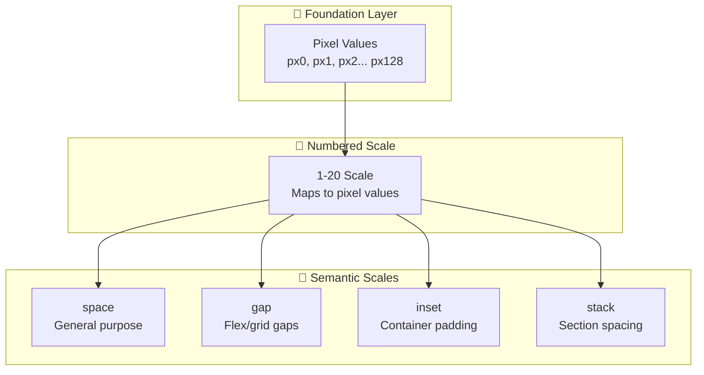

import CopyableCode from '@site/src/components/CopyableCode';

# Spacing System

The Design Great spacing system provides consistent, scalable spacing tokens for margins, padding, and gaps.

## Architecture

The spacing system uses a **three-layer architecture**:

## Quick Reference

| Scale | Purpose | Range | Common Use |
|-------|---------|-------|------------|
| **space** | General-purpose | 2xs→3xl | Any spacing need |
| **gap** | Flex/grid gaps | xs→xl | Between items |
| **inset** | Container padding | xs→xl | Inside containers |
| **stack** | Vertical sections | xs→xl | Between page sections |

## Key Features

- ✅ **Consistent scale** — Based on 4px/8px grid system
- ✅ **Semantic naming** — `xs`, `sm`, `md`, `lg`, `xl` sizes
- ✅ **Purpose-built scales** — Different ranges for different use cases
- ✅ **Rem-based** — Respects user font size preferences

---

## In This Section

| Guide | What You'll Learn |
|-------|-------------------|
| [Pixel Values](./pixel-values) | Foundation layer reference |
| [Semantic Scales](./semantic-scales) | `space`, `gap`, `inset`, `stack` usage |

---

## Related

- [Basic Usage](/design-token/guides/basic-usage) — Using tokens in CSS
- [Tailwind Integration](/design-token/guides/tailwind) — Using with Tailwind

