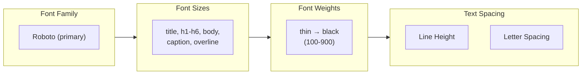

import CopyableCode from '@site/src/components/CopyableCode';

# Typography System

The Design Great typography system provides consistent text styling tokens for fonts, sizes, weights, and spacing.

## Typography Stack

## Quick Reference

| Category | Tokens | Common Use |
|----------|--------|------------|
| **Font Size** | `title`, `h1`-`h6`, `body`, `caption`, `overline` | Text sizing |
| **Font Weight** | `thin` → `black` (10 weights) | Text emphasis |
| **Line Height** | `none`, `tight`, `snug`, `normal`, `relaxed`, `loose` | Text readability |
| **Letter Spacing** | `tighter` → `widest` | Heading/label adjustments |

## Key Features

- ✅ **Roboto font family** — Modern, readable sans-serif
- ✅ **Semantic size names** — `h1`, `body`, `caption` etc.
- ✅ **Full weight range** — 100-900 for all design needs
- ✅ **Unitless line heights** — Scale with any font size

---

## In This Section

| Guide | What You'll Learn |
|-------|-------------------|
| [Font Sizes](./font-sizes) | Semantic and scale-based sizes |
| [Font Weights](./font-weights) | Weight scale from thin to black |
| [Line Height & Letter Spacing](./text-spacing) | Text spacing tokens |

---

## Related

- [Fonts Guide](/design-token/guides/fonts) — Font installation and setup
- [Basic Usage](/design-token/guides/basic-usage) — Using tokens in CSS

