import CopyableCode from '@site/src/components/CopyableCode';

# Core Concepts & Theme-Awareness

Understanding how colors adapt to themes is **fundamental** to using the Design Great color system effectively. This guide explains what switches between themes and what stays fixed.

## Table of Contents

**🎯 Getting Started** — *Understand the fundamentals*
- [Two-Layer Architecture](#two-layer-architecture) — How the color system is structured
- [Why This Design?](#why-this-design) — Benefits of this approach
- [Core Color Palette](#core-color-palette) — Complete overview of all available colors
- [Visual Comparison](#visual-comparison) — See switching in action

**🔍 Deep Dive** — *Learn how it works*
- [How Semantic Aliases Switch Between Themes](#how-semantic-aliases-switch-between-themes) — The switching mechanism explained
  - [The Contrast Inversion Pattern](#the-contrast-inversion-pattern)
  - [The Switching Mechanism](#the-switching-mechanism)

**⚡ Practical Guide** — *Start using it*
- [Best Practices](#best-practices) — Do's, don'ts, and common mistakes
- [Usage Examples](#usage-examples) — Copy-paste ready code snippets

**🛠️ Reference** — *Technical details and resources*
- [Technical Details](#technical-details) — CSS implementation and specificity
- [Related Topics](#related-topics) — Additional documentation

## Two-Layer Architecture

The Design Great color system is built on **base colors** and uses a **two-layer architecture** for automatic theme adaptation:


This design provides both **stability** (fixed base colors and gradient levels) and **flexibility** (semantic aliases that adapt to themes).

## Why This Design?

This architecture provides five key benefits:

1. **Single Source of Truth**: Base colors define your brand identity once
2. **Stable Palette**: Fixed gradient levels provide predictable building blocks
3. **Smart Mapping**: Aliases automatically choose appropriate contrast levels
4. **Automatic Adaptation**: Write once, works in both themes
5. **Developer Experience**: Use semantic names, get theming for free

```mermaid
flowchart LR
    A["1️⃣ Define<br/>Base Colors"] --> B["2️⃣ Generate<br/>Gradient Palette"]
    B --> C["3️⃣ Apply<br/>Semantic Meaning"]
    C --> D["4️⃣ Automatic<br/>Theming ✨"]
    
    style A fill:#e6f2ff,stroke:#0055cc,stroke-width:2px,color:#000
    style B fill:#f5f5f5,stroke:#808080,stroke-width:2px,color:#000
    style C fill:#fff4e6,stroke:#ff8c00,stroke-width:2px,color:#000
    style D fill:#e6f9f0,stroke:#228b22,stroke-width:2px,color:#000
```



## Core Color Palette

### Base Colors (Foundation)

**Base colors are the foundation** - they are single, carefully chosen hex values that never change.

| grey | red | orange | yellow | green | teal | blue | purple | magenta | lime |
|------|-----|--------|--------|-------|------|------|--------|---------|------|
| <div className="color-demo" style={{backgroundColor: 'var(--dg-color-base-grey)'}}></div> | <div className="color-demo" style={{backgroundColor: 'var(--dg-color-base-red)'}}></div> | <div className="color-demo" style={{backgroundColor: 'var(--dg-color-base-orange)'}}></div> | <div className="color-demo" style={{backgroundColor: 'var(--dg-color-base-yellow)'}}></div> | <div className="color-demo" style={{backgroundColor: 'var(--dg-color-base-green)'}}></div> | <div className="color-demo" style={{backgroundColor: 'var(--dg-color-base-teal)'}}></div> | <div className="color-demo" style={{backgroundColor: 'var(--dg-color-base-blue)'}}></div> | <div className="color-demo" style={{backgroundColor: 'var(--dg-color-base-purple)'}}></div> | <div className="color-demo" style={{backgroundColor: 'var(--dg-color-base-magenta)'}}></div> | <div className="color-demo" style={{backgroundColor: 'var(--dg-color-base-lime)'}}></div> |

**Role:** These are the seed colors from which all gradient levels are algorithmically generated. They represent the core brand colors at their purest form.

### Fixed Gradient Levels

**ALL numbered gradient levels have the same hex values in both themes.** They are algorithmically generated from base colors to form a stable, theme-independent palette.

#### **Grey/Neutral (12 levels)**

|  | Level 1 | Level 2 | Level 3 | Level 4 | Level 5 | Level 6 | Level 7 | Level 8 | Level 9 | Level 10 | Level 11 | Level 12 |
|---|---------|---------|---------|---------|---------|---------|---------|---------|---------|----------|----------|----------|
| **grey / neutral** | <div className="color-demo" style={{backgroundColor: 'var(--dg-color-accent-grey-1)'}}></div> | <div className="color-demo" style={{backgroundColor: 'var(--dg-color-accent-grey-2)'}}></div> | <div className="color-demo" style={{backgroundColor: 'var(--dg-color-accent-grey-3)'}}></div> | <div className="color-demo" style={{backgroundColor: 'var(--dg-color-accent-grey-4)'}}></div> | <div className="color-demo" style={{backgroundColor: 'var(--dg-color-accent-grey-5)'}}></div> | <div className="color-demo" style={{backgroundColor: 'var(--dg-color-accent-grey-6)'}}></div> | <div className="color-demo" style={{backgroundColor: 'var(--dg-color-accent-grey-7)'}}></div> | <div className="color-demo" style={{backgroundColor: 'var(--dg-color-accent-grey-8)'}}></div> | <div className="color-demo" style={{backgroundColor: 'var(--dg-color-accent-grey-9)'}}></div> | <div className="color-demo" style={{backgroundColor: 'var(--dg-color-accent-grey-10)'}}></div> | <div className="color-demo" style={{backgroundColor: 'var(--dg-color-accent-grey-11)'}}></div> | <div className="color-demo" style={{backgroundColor: 'var(--dg-color-accent-grey-12)'}}></div> |

#### **Warm Colors (10 levels each)**

|  | Level 1 | Level 2 | Level 3 | Level 4 | Level 5 | Level 6 | Level 7 | Level 8 | Level 9 | Level 10 |
|---|---------|---------|---------|---------|---------|---------|---------|---------|---------|----------|
| **red** | <div className="color-demo" style={{backgroundColor: 'var(--dg-color-accent-red-1)'}}></div> | <div className="color-demo" style={{backgroundColor: 'var(--dg-color-accent-red-2)'}}></div> | <div className="color-demo" style={{backgroundColor: 'var(--dg-color-accent-red-3)'}}></div> | <div className="color-demo" style={{backgroundColor: 'var(--dg-color-accent-red-4)'}}></div> | <div className="color-demo" style={{backgroundColor: 'var(--dg-color-accent-red-5)'}}></div> | <div className="color-demo" style={{backgroundColor: 'var(--dg-color-accent-red-6)'}}></div> | <div className="color-demo" style={{backgroundColor: 'var(--dg-color-accent-red-7)'}}></div> | <div className="color-demo" style={{backgroundColor: 'var(--dg-color-accent-red-8)'}}></div> | <div className="color-demo" style={{backgroundColor: 'var(--dg-color-accent-red-9)'}}></div> | <div className="color-demo" style={{backgroundColor: 'var(--dg-color-accent-red-10)'}}></div> |
| **orange** | <div className="color-demo" style={{backgroundColor: 'var(--dg-color-accent-orange-1)'}}></div> | <div className="color-demo" style={{backgroundColor: 'var(--dg-color-accent-orange-2)'}}></div> | <div className="color-demo" style={{backgroundColor: 'var(--dg-color-accent-orange-3)'}}></div> | <div className="color-demo" style={{backgroundColor: 'var(--dg-color-accent-orange-4)'}}></div> | <div className="color-demo" style={{backgroundColor: 'var(--dg-color-accent-orange-5)'}}></div> | <div className="color-demo" style={{backgroundColor: 'var(--dg-color-accent-orange-6)'}}></div> | <div className="color-demo" style={{backgroundColor: 'var(--dg-color-accent-orange-7)'}}></div> | <div className="color-demo" style={{backgroundColor: 'var(--dg-color-accent-orange-8)'}}></div> | <div className="color-demo" style={{backgroundColor: 'var(--dg-color-accent-orange-9)'}}></div> | <div className="color-demo" style={{backgroundColor: 'var(--dg-color-accent-orange-10)'}}></div> |
| **yellow** | <div className="color-demo" style={{backgroundColor: 'var(--dg-color-accent-yellow-1)'}}></div> | <div className="color-demo" style={{backgroundColor: 'var(--dg-color-accent-yellow-2)'}}></div> | <div className="color-demo" style={{backgroundColor: 'var(--dg-color-accent-yellow-3)'}}></div> | <div className="color-demo" style={{backgroundColor: 'var(--dg-color-accent-yellow-4)'}}></div> | <div className="color-demo" style={{backgroundColor: 'var(--dg-color-accent-yellow-5)'}}></div> | <div className="color-demo" style={{backgroundColor: 'var(--dg-color-accent-yellow-6)'}}></div> | <div className="color-demo" style={{backgroundColor: 'var(--dg-color-accent-yellow-7)'}}></div> | <div className="color-demo" style={{backgroundColor: 'var(--dg-color-accent-yellow-8)'}}></div> | <div className="color-demo" style={{backgroundColor: 'var(--dg-color-accent-yellow-9)'}}></div> | <div className="color-demo" style={{backgroundColor: 'var(--dg-color-accent-yellow-10)'}}></div> |

#### **Cool Colors (10 levels each)**

|  | Level 1 | Level 2 | Level 3 | Level 4 | Level 5 | Level 6 | Level 7 | Level 8 | Level 9 | Level 10 |
|---|---------|---------|---------|---------|---------|---------|---------|---------|---------|----------|
| **green** | <div className="color-demo" style={{backgroundColor: 'var(--dg-color-accent-green-1)'}}></div> | <div className="color-demo" style={{backgroundColor: 'var(--dg-color-accent-green-2)'}}></div> | <div className="color-demo" style={{backgroundColor: 'var(--dg-color-accent-green-3)'}}></div> | <div className="color-demo" style={{backgroundColor: 'var(--dg-color-accent-green-4)'}}></div> | <div className="color-demo" style={{backgroundColor: 'var(--dg-color-accent-green-5)'}}></div> | <div className="color-demo" style={{backgroundColor: 'var(--dg-color-accent-green-6)'}}></div> | <div className="color-demo" style={{backgroundColor: 'var(--dg-color-accent-green-7)'}}></div> | <div className="color-demo" style={{backgroundColor: 'var(--dg-color-accent-green-8)'}}></div> | <div className="color-demo" style={{backgroundColor: 'var(--dg-color-accent-green-9)'}}></div> | <div className="color-demo" style={{backgroundColor: 'var(--dg-color-accent-green-10)'}}></div> |
| **teal** | <div className="color-demo" style={{backgroundColor: 'var(--dg-color-accent-teal-1)'}}></div> | <div className="color-demo" style={{backgroundColor: 'var(--dg-color-accent-teal-2)'}}></div> | <div className="color-demo" style={{backgroundColor: 'var(--dg-color-accent-teal-3)'}}></div> | <div className="color-demo" style={{backgroundColor: 'var(--dg-color-accent-teal-4)'}}></div> | <div className="color-demo" style={{backgroundColor: 'var(--dg-color-accent-teal-5)'}}></div> | <div className="color-demo" style={{backgroundColor: 'var(--dg-color-accent-teal-6)'}}></div> | <div className="color-demo" style={{backgroundColor: 'var(--dg-color-accent-teal-7)'}}></div> | <div className="color-demo" style={{backgroundColor: 'var(--dg-color-accent-teal-8)'}}></div> | <div className="color-demo" style={{backgroundColor: 'var(--dg-color-accent-teal-9)'}}></div> | <div className="color-demo" style={{backgroundColor: 'var(--dg-color-accent-teal-10)'}}></div> |
| **blue** | <div className="color-demo" style={{backgroundColor: 'var(--dg-color-accent-blue-1)'}}></div> | <div className="color-demo" style={{backgroundColor: 'var(--dg-color-accent-blue-2)'}}></div> | <div className="color-demo" style={{backgroundColor: 'var(--dg-color-accent-blue-3)'}}></div> | <div className="color-demo" style={{backgroundColor: 'var(--dg-color-accent-blue-4)'}}></div> | <div className="color-demo" style={{backgroundColor: 'var(--dg-color-accent-blue-5)'}}></div> | <div className="color-demo" style={{backgroundColor: 'var(--dg-color-accent-blue-6)'}}></div> | <div className="color-demo" style={{backgroundColor: 'var(--dg-color-accent-blue-7)'}}></div> | <div className="color-demo" style={{backgroundColor: 'var(--dg-color-accent-blue-8)'}}></div> | <div className="color-demo" style={{backgroundColor: 'var(--dg-color-accent-blue-9)'}}></div> | <div className="color-demo" style={{backgroundColor: 'var(--dg-color-accent-blue-10)'}}></div> |
| **purple** | <div className="color-demo" style={{backgroundColor: 'var(--dg-color-accent-purple-1)'}}></div> | <div className="color-demo" style={{backgroundColor: 'var(--dg-color-accent-purple-2)'}}></div> | <div className="color-demo" style={{backgroundColor: 'var(--dg-color-accent-purple-3)'}}></div> | <div className="color-demo" style={{backgroundColor: 'var(--dg-color-accent-purple-4)'}}></div> | <div className="color-demo" style={{backgroundColor: 'var(--dg-color-accent-purple-5)'}}></div> | <div className="color-demo" style={{backgroundColor: 'var(--dg-color-accent-purple-6)'}}></div> | <div className="color-demo" style={{backgroundColor: 'var(--dg-color-accent-purple-7)'}}></div> | <div className="color-demo" style={{backgroundColor: 'var(--dg-color-accent-purple-8)'}}></div> | <div className="color-demo" style={{backgroundColor: 'var(--dg-color-accent-purple-9)'}}></div> | <div className="color-demo" style={{backgroundColor: 'var(--dg-color-accent-purple-10)'}}></div> |

#### **Vibrant Colors (10 levels each)**

|  | Level 1 | Level 2 | Level 3 | Level 4 | Level 5 | Level 6 | Level 7 | Level 8 | Level 9 | Level 10 |
|---|---------|---------|---------|---------|---------|---------|---------|---------|---------|----------|
| **magenta** | <div className="color-demo" style={{backgroundColor: 'var(--dg-color-accent-magenta-1)'}}></div> | <div className="color-demo" style={{backgroundColor: 'var(--dg-color-accent-magenta-2)'}}></div> | <div className="color-demo" style={{backgroundColor: 'var(--dg-color-accent-magenta-3)'}}></div> | <div className="color-demo" style={{backgroundColor: 'var(--dg-color-accent-magenta-4)'}}></div> | <div className="color-demo" style={{backgroundColor: 'var(--dg-color-accent-magenta-5)'}}></div> | <div className="color-demo" style={{backgroundColor: 'var(--dg-color-accent-magenta-6)'}}></div> | <div className="color-demo" style={{backgroundColor: 'var(--dg-color-accent-magenta-7)'}}></div> | <div className="color-demo" style={{backgroundColor: 'var(--dg-color-accent-magenta-8)'}}></div> | <div className="color-demo" style={{backgroundColor: 'var(--dg-color-accent-magenta-9)'}}></div> | <div className="color-demo" style={{backgroundColor: 'var(--dg-color-accent-magenta-10)'}}></div> |
| **lime** | <div className="color-demo" style={{backgroundColor: 'var(--dg-color-accent-lime-1)'}}></div> | <div className="color-demo" style={{backgroundColor: 'var(--dg-color-accent-lime-2)'}}></div> | <div className="color-demo" style={{backgroundColor: 'var(--dg-color-accent-lime-3)'}}></div> | <div className="color-demo" style={{backgroundColor: 'var(--dg-color-accent-lime-4)'}}></div> | <div className="color-demo" style={{backgroundColor: 'var(--dg-color-accent-lime-5)'}}></div> | <div className="color-demo" style={{backgroundColor: 'var(--dg-color-accent-lime-6)'}}></div> | <div className="color-demo" style={{backgroundColor: 'var(--dg-color-accent-lime-7)'}}></div> | <div className="color-demo" style={{backgroundColor: 'var(--dg-color-accent-lime-8)'}}></div> | <div className="color-demo" style={{backgroundColor: 'var(--dg-color-accent-lime-9)'}}></div> | <div className="color-demo" style={{backgroundColor: 'var(--dg-color-accent-lime-10)'}}></div> |

**Use Case:** Building blocks for semantic aliases, or when you need consistent colors (e.g., brand logos, data visualizations).

### Theme-Switchable Semantic Aliases

**ALL semantic aliases are theme-switchable** - they map to different gradient levels based on the current theme.

#### **Grey/Neutral Aliases (12 aliases)**

|  | silent | dullest | duller | dull | lowest | lower | low | subtlest | subtler | subtle | DEFAULT | bold |
|---|--------|---------|--------|------|--------|-------|-----|----------|---------|--------|---------|------|
| **grey / neutral** | <div className="color-demo" style={{backgroundColor: 'var(--dg-color-accent-grey-silent)'}}></div> | <div className="color-demo" style={{backgroundColor: 'var(--dg-color-accent-grey-dullest)'}}></div> | <div className="color-demo" style={{backgroundColor: 'var(--dg-color-accent-grey-duller)'}}></div> | <div className="color-demo" style={{backgroundColor: 'var(--dg-color-accent-grey-dull)'}}></div> | <div className="color-demo" style={{backgroundColor: 'var(--dg-color-accent-grey-lowest)'}}></div> | <div className="color-demo" style={{backgroundColor: 'var(--dg-color-accent-grey-lower)'}}></div> | <div className="color-demo" style={{backgroundColor: 'var(--dg-color-accent-grey-low)'}}></div> | <div className="color-demo" style={{backgroundColor: 'var(--dg-color-accent-grey-subtlest)'}}></div> | <div className="color-demo" style={{backgroundColor: 'var(--dg-color-accent-grey-subtler)'}}></div> | <div className="color-demo" style={{backgroundColor: 'var(--dg-color-accent-grey-subtle)'}}></div> | <div className="color-demo" style={{backgroundColor: 'var(--dg-color-accent-grey-default)'}}></div> | <div className="color-demo" style={{backgroundColor: 'var(--dg-color-accent-grey-bold)'}}></div> |

#### **Warm Color Aliases**

Saturated colors have 10 aliases focused on emphasis levels:

|  | lowest | lower | low | subtlest | subtler | subtle | DEFAULT | bold | bolder | boldest |
|---|--------|-------|-----|----------|---------|--------|---------|------|--------|---------|
| **red** | <div className="color-demo" style={{backgroundColor: 'var(--dg-color-accent-red-lowest)'}}></div> | <div className="color-demo" style={{backgroundColor: 'var(--dg-color-accent-red-lower)'}}></div> | <div className="color-demo" style={{backgroundColor: 'var(--dg-color-accent-red-low)'}}></div> | <div className="color-demo" style={{backgroundColor: 'var(--dg-color-accent-red-subtlest)'}}></div> | <div className="color-demo" style={{backgroundColor: 'var(--dg-color-accent-red-subtler)'}}></div> | <div className="color-demo" style={{backgroundColor: 'var(--dg-color-accent-red-subtle)'}}></div> | <div className="color-demo" style={{backgroundColor: 'var(--dg-color-accent-red-default)'}}></div> | <div className="color-demo" style={{backgroundColor: 'var(--dg-color-accent-red-bold)'}}></div> | <div className="color-demo" style={{backgroundColor: 'var(--dg-color-accent-red-bolder)'}}></div> | <div className="color-demo" style={{backgroundColor: 'var(--dg-color-accent-red-boldest)'}}></div> |
| **orange** | <div className="color-demo" style={{backgroundColor: 'var(--dg-color-accent-orange-lowest)'}}></div> | <div className="color-demo" style={{backgroundColor: 'var(--dg-color-accent-orange-lower)'}}></div> | <div className="color-demo" style={{backgroundColor: 'var(--dg-color-accent-orange-low)'}}></div> | <div className="color-demo" style={{backgroundColor: 'var(--dg-color-accent-orange-subtlest)'}}></div> | <div className="color-demo" style={{backgroundColor: 'var(--dg-color-accent-orange-subtler)'}}></div> | <div className="color-demo" style={{backgroundColor: 'var(--dg-color-accent-orange-subtle)'}}></div> | <div className="color-demo" style={{backgroundColor: 'var(--dg-color-accent-orange-default)'}}></div> | <div className="color-demo" style={{backgroundColor: 'var(--dg-color-accent-orange-bold)'}}></div> | <div className="color-demo" style={{backgroundColor: 'var(--dg-color-accent-orange-bolder)'}}></div> | <div className="color-demo" style={{backgroundColor: 'var(--dg-color-accent-orange-boldest)'}}></div> |
| **yellow** | <div className="color-demo" style={{backgroundColor: 'var(--dg-color-accent-yellow-lowest)'}}></div> | <div className="color-demo" style={{backgroundColor: 'var(--dg-color-accent-yellow-lower)'}}></div> | <div className="color-demo" style={{backgroundColor: 'var(--dg-color-accent-yellow-low)'}}></div> | <div className="color-demo" style={{backgroundColor: 'var(--dg-color-accent-yellow-subtlest)'}}></div> | <div className="color-demo" style={{backgroundColor: 'var(--dg-color-accent-yellow-subtler)'}}></div> | <div className="color-demo" style={{backgroundColor: 'var(--dg-color-accent-yellow-subtle)'}}></div> | <div className="color-demo" style={{backgroundColor: 'var(--dg-color-accent-yellow-default)'}}></div> | <div className="color-demo" style={{backgroundColor: 'var(--dg-color-accent-yellow-bold)'}}></div> | <div className="color-demo" style={{backgroundColor: 'var(--dg-color-accent-yellow-bolder)'}}></div> | <div className="color-demo" style={{backgroundColor: 'var(--dg-color-accent-yellow-boldest)'}}></div> |

#### **Cool Color Aliases**

|  | lowest | lower | low | subtlest | subtler | subtle | DEFAULT | bold | bolder | boldest |
|---|--------|-------|-----|----------|---------|--------|---------|------|--------|---------|
| **green** | <div className="color-demo" style={{backgroundColor: 'var(--dg-color-accent-green-lowest)'}}></div> | <div className="color-demo" style={{backgroundColor: 'var(--dg-color-accent-green-lower)'}}></div> | <div className="color-demo" style={{backgroundColor: 'var(--dg-color-accent-green-low)'}}></div> | <div className="color-demo" style={{backgroundColor: 'var(--dg-color-accent-green-subtlest)'}}></div> | <div className="color-demo" style={{backgroundColor: 'var(--dg-color-accent-green-subtler)'}}></div> | <div className="color-demo" style={{backgroundColor: 'var(--dg-color-accent-green-subtle)'}}></div> | <div className="color-demo" style={{backgroundColor: 'var(--dg-color-accent-green-default)'}}></div> | <div className="color-demo" style={{backgroundColor: 'var(--dg-color-accent-green-bold)'}}></div> | <div className="color-demo" style={{backgroundColor: 'var(--dg-color-accent-green-bolder)'}}></div> | <div className="color-demo" style={{backgroundColor: 'var(--dg-color-accent-green-boldest)'}}></div> |
| **teal** | <div className="color-demo" style={{backgroundColor: 'var(--dg-color-accent-teal-lowest)'}}></div> | <div className="color-demo" style={{backgroundColor: 'var(--dg-color-accent-teal-lower)'}}></div> | <div className="color-demo" style={{backgroundColor: 'var(--dg-color-accent-teal-low)'}}></div> | <div className="color-demo" style={{backgroundColor: 'var(--dg-color-accent-teal-subtlest)'}}></div> | <div className="color-demo" style={{backgroundColor: 'var(--dg-color-accent-teal-subtler)'}}></div> | <div className="color-demo" style={{backgroundColor: 'var(--dg-color-accent-teal-subtle)'}}></div> | <div className="color-demo" style={{backgroundColor: 'var(--dg-color-accent-teal-default)'}}></div> | <div className="color-demo" style={{backgroundColor: 'var(--dg-color-accent-teal-bold)'}}></div> | <div className="color-demo" style={{backgroundColor: 'var(--dg-color-accent-teal-bolder)'}}></div> | <div className="color-demo" style={{backgroundColor: 'var(--dg-color-accent-teal-boldest)'}}></div> |
| **blue** | <div className="color-demo" style={{backgroundColor: 'var(--dg-color-accent-blue-lowest)'}}></div> | <div className="color-demo" style={{backgroundColor: 'var(--dg-color-accent-blue-lower)'}}></div> | <div className="color-demo" style={{backgroundColor: 'var(--dg-color-accent-blue-low)'}}></div> | <div className="color-demo" style={{backgroundColor: 'var(--dg-color-accent-blue-subtlest)'}}></div> | <div className="color-demo" style={{backgroundColor: 'var(--dg-color-accent-blue-subtler)'}}></div> | <div className="color-demo" style={{backgroundColor: 'var(--dg-color-accent-blue-subtle)'}}></div> | <div className="color-demo" style={{backgroundColor: 'var(--dg-color-accent-blue-default)'}}></div> | <div className="color-demo" style={{backgroundColor: 'var(--dg-color-accent-blue-bold)'}}></div> | <div className="color-demo" style={{backgroundColor: 'var(--dg-color-accent-blue-bolder)'}}></div> | <div className="color-demo" style={{backgroundColor: 'var(--dg-color-accent-blue-boldest)'}}></div> |
| **purple** | <div className="color-demo" style={{backgroundColor: 'var(--dg-color-accent-purple-lowest)'}}></div> | <div className="color-demo" style={{backgroundColor: 'var(--dg-color-accent-purple-lower)'}}></div> | <div className="color-demo" style={{backgroundColor: 'var(--dg-color-accent-purple-low)'}}></div> | <div className="color-demo" style={{backgroundColor: 'var(--dg-color-accent-purple-subtlest)'}}></div> | <div className="color-demo" style={{backgroundColor: 'var(--dg-color-accent-purple-subtler)'}}></div> | <div className="color-demo" style={{backgroundColor: 'var(--dg-color-accent-purple-subtle)'}}></div> | <div className="color-demo" style={{backgroundColor: 'var(--dg-color-accent-purple-default)'}}></div> | <div className="color-demo" style={{backgroundColor: 'var(--dg-color-accent-purple-bold)'}}></div> | <div className="color-demo" style={{backgroundColor: 'var(--dg-color-accent-purple-bolder)'}}></div> | <div className="color-demo" style={{backgroundColor: 'var(--dg-color-accent-purple-boldest)'}}></div> |

#### **Vibrant Color Aliases**

|  | lowest | lower | low | subtlest | subtler | subtle | DEFAULT | bold | bolder | boldest |
|---|--------|-------|-----|----------|---------|--------|---------|------|--------|---------|
| **magenta** | <div className="color-demo" style={{backgroundColor: 'var(--dg-color-accent-magenta-lowest)'}}></div> | <div className="color-demo" style={{backgroundColor: 'var(--dg-color-accent-magenta-lower)'}}></div> | <div className="color-demo" style={{backgroundColor: 'var(--dg-color-accent-magenta-low)'}}></div> | <div className="color-demo" style={{backgroundColor: 'var(--dg-color-accent-magenta-subtlest)'}}></div> | <div className="color-demo" style={{backgroundColor: 'var(--dg-color-accent-magenta-subtler)'}}></div> | <div className="color-demo" style={{backgroundColor: 'var(--dg-color-accent-magenta-subtle)'}}></div> | <div className="color-demo" style={{backgroundColor: 'var(--dg-color-accent-magenta-default)'}}></div> | <div className="color-demo" style={{backgroundColor: 'var(--dg-color-accent-magenta-bold)'}}></div> | <div className="color-demo" style={{backgroundColor: 'var(--dg-color-accent-magenta-bolder)'}}></div> | <div className="color-demo" style={{backgroundColor: 'var(--dg-color-accent-magenta-boldest)'}}></div> |
| **lime** | <div className="color-demo" style={{backgroundColor: 'var(--dg-color-accent-lime-lowest)'}}></div> | <div className="color-demo" style={{backgroundColor: 'var(--dg-color-accent-lime-lower)'}}></div> | <div className="color-demo" style={{backgroundColor: 'var(--dg-color-accent-lime-low)'}}></div> | <div className="color-demo" style={{backgroundColor: 'var(--dg-color-accent-lime-subtlest)'}}></div> | <div className="color-demo" style={{backgroundColor: 'var(--dg-color-accent-lime-subtler)'}}></div> | <div className="color-demo" style={{backgroundColor: 'var(--dg-color-accent-lime-subtle)'}}></div> | <div className="color-demo" style={{backgroundColor: 'var(--dg-color-accent-lime-default)'}}></div> | <div className="color-demo" style={{backgroundColor: 'var(--dg-color-accent-lime-bold)'}}></div> | <div className="color-demo" style={{backgroundColor: 'var(--dg-color-accent-lime-bolder)'}}></div> | <div className="color-demo" style={{backgroundColor: 'var(--dg-color-accent-lime-boldest)'}}></div> |

**Use Case:** UI elements that need automatic theme adaptation (text, backgrounds, borders).

:::note Why Only 10 Saturated Aliases?
Saturated colors (red, orange, yellow, green, teal, blue, purple, magenta, lime) have 10 aliases (from `lowest` to `boldest`) focused on emphasis and foreground use. Grey/neutral uniquely has 12 aliases because it's used for both foreground text and background surfaces, requiring additional subtle background aliases (`silent`, `dullest`, `duller`, `dull`).
:::

## Visual Comparison

Now that you've seen the complete palette, let's understand how theme switching actually works. These interactive examples demonstrate the difference between fixed and switchable colors:

:::tip Try It Yourself
Toggle between light and dark themes using the theme switcher in the navbar to see the semantic aliases change in real-time, while base colors and fixed levels stay constant!
:::

| Type | Example | Light Value | Dark Value | Live Demo | Behavior |
|------|---------|-------------|------------|-----------|----------|
| **Base Color** | `base.blue` | `#0055cc` | `#0055cc` | <div className="color-demo" style={{backgroundColor: 'var(--dg-color-base-blue)'}}></div> | ✅ SAME |
| **Fixed Level** | `accent.grey.1` | `#ffffff` | `#ffffff` | <div className="color-demo" style={{backgroundColor: 'var(--dg-color-accent-grey-1)'}}></div> | ✅ SAME |
| **Fixed Level** | `accent.grey.12` | `#0c0c0d` | `#0c0c0d` | <div className="color-demo" style={{backgroundColor: 'var(--dg-color-accent-grey-12)'}}></div> | ✅ SAME |
| **Semantic Alias** | `accent.grey.silent` | `#ffffff` (→ level 1) | `#0c0c0d` (→ level 12) | <div className="color-demo" style={{backgroundColor: 'var(--dg-color-accent-grey-silent)'}}></div> | 🔄 SWITCHED |
| **Semantic Alias** | `accent.grey.bold` | `#0c0c0d` (→ level 12) | `#ffffff` (→ level 1) | <div className="color-demo" style={{backgroundColor: 'var(--dg-color-accent-grey-bold)'}}></div> | 🔄 SWITCHED |
| **Semantic Alias** | `accent.blue.DEFAULT` | `#0055cc` (→ level 7) | `#3388ff` (→ level 4) | <div className="color-demo" style={{backgroundColor: 'var(--dg-color-accent-blue-default)'}}></div> | 🔄 SWITCHED |

## How Semantic Aliases Switch Between Themes

Semantic aliases provide **automatic theme adaptation** by pointing to different gradient levels based on the active theme. This is the core mechanism that makes the Design Great color system theme-aware, as introduced in the [two-layer architecture](#two-layer-architecture) above.

### The Contrast Inversion Pattern

The switching follows a **mirror pattern** to maintain proper contrast:

```mermaid
flowchart TB
    subgraph Pattern["🔄 Contrast Inversion Pattern"]
        direction LR
        
        subgraph Light["☀️ Light Theme<br/><small>Light background needs dark text</small>"]
            L["Aliases point to<br/>DARKER levels<br/>(8-12)"]
        end
        
        subgraph Dark["🌙 Dark Theme<br/><small>Dark background needs light text</small>"]
            D["Aliases point to<br/>LIGHTER levels<br/>(1-5)"]
        end
        
        Light -.Mirror.-> Dark
    end
    
    style Pattern fill:#e6f2ff,stroke:#0055cc,stroke-width:2px
    style Light fill:#f9f9f9,color:#000,stroke:#ccc,stroke-width:2px
    style Dark fill:#2a2a2a,color:#fff,stroke:#666,stroke-width:2px
    style L fill:#fff,color:#000,stroke:#ddd,stroke-width:1px
    style D fill:#1a1a1a,color:#fff,stroke:#444,stroke-width:1px
```



**Why This Works:**
1. **Light Theme**: Light background (#fff) needs dark text → aliases point to levels 8-12
2. **Dark Theme**: Dark background (#000) needs light text → aliases point to levels 1-5
3. **Result**: Automatic appropriate contrast in both themes!

### The Switching Mechanism

<svg width="100%" viewBox="0 0 900 720" xmlns="http://www.w3.org/2000/svg" style={{maxWidth: '900px', margin: '2rem auto', display: 'block'}}>
  <defs>
    <marker id="arrow" markerWidth="10" markerHeight="10" refX="10" refY="5" orient="auto">
      <polygon points="0,0 10,5 0,10" fill="#555"/>
    </marker>
  </defs>
  
  {/* Title */}
  <text x="450" y="25" textAnchor="middle" fontSize="14" fontWeight="bold" fill="#666">
    Grey/Neutral Color Theme Switching
  </text>
  
  {/* Center gradient column */}
  <g id="gradient-levels">
    <text x="450" y="55" textAnchor="middle" fontSize="11" fontWeight="600" fill="#999">FIXED GRADIENT LEVELS</text>
    {[
      {level: 1, y: 75, bg: '#fff', text: '#000'},
      {level: 2, y: 125, bg: '#e8e8e9', text: '#000'},
      {level: 3, y: 175, bg: '#d0d0d3', text: '#000'},
      {level: 4, y: 225, bg: '#acacb2', text: '#000'},
      {level: 5, y: 275, bg: '#8c8c95', text: '#fff'},
      {level: 6, y: 325, bg: '#6e6e7a', text: '#fff'},
      {level: 7, y: 375, bg: '#53535e', text: '#fff'},
      {level: 8, y: 425, bg: '#40404a', text: '#fff'},
      {level: 9, y: 475, bg: '#2d2d36', text: '#fff'},
      {level: 10, y: 525, bg: '#1f1f24', text: '#fff'},
      {level: 11, y: 575, bg: '#1d1d1f', text: '#fff'},
      {level: 12, y: 625, bg: '#0c0c0d', text: '#fff'}
    ].map(({level, y, bg, text}) => (
      <g key={level}>
        <rect x="375" y={y} width="150" height="40" rx="2" fill={bg} stroke="#999" strokeWidth="1"/>
        <text x="450" y={y+25} textAnchor="middle" fontSize="13" fontWeight="600" fill={text}>grey.{level}</text>
      </g>
    ))}
  </g>
  
  {/* Left aliases - Light Theme */}
  <g id="light-aliases">
    <text x="20" y="55" fontSize="11" fontWeight="600" fill="#999">☀️ LIGHT THEME</text>
    {[
      {name: 'silent', y: 75, type: 'bg'},
      {name: 'dullest', y: 125, type: 'bg'},
      {name: 'duller', y: 175, type: 'bg'},
      {name: 'dull', y: 225, type: 'bg'},
      {name: 'lowest', y: 275, type: 'bg'},
      {name: 'lower', y: 325, type: 'bg'},
      {name: 'low', y: 375, type: 'bg'},
      {name: 'subtlest', y: 425, type: 'fg'},
      {name: 'subtler', y: 475, type: 'fg'},
      {name: 'subtle', y: 525, type: 'fg'},
      {name: 'DEFAULT', y: 575, type: 'fg'},
      {name: 'bold', y: 625, type: 'fg'}
    ].map(({name, y, type}) => {
      const isDefault = name === 'DEFAULT';
      return (
        <g key={name}>
          <path d={`M 25 ${y} L 120 ${y} L 120 ${y+40} L 25 ${y+40} L 20 ${y+20} Z`} 
                fill={isDefault ? '#f3f4f6' : '#e5e7eb'}
                stroke={type === 'bg' ? '#d1d5db' : '#374151'}
                strokeWidth={type === 'bg' ? '1' : (isDefault ? '2.5' : '2')}/>
          <text x="70" y={y+25} textAnchor="middle" fontSize="12" fontWeight={isDefault ? '700' : '600'} fill="#374151">grey.{name}</text>
          <line x1="120" y1={y+20} x2="365" y2={y+20} stroke="#555" strokeWidth="2" markerEnd="url(#arrow)"/>
        </g>
      );
    })}
  </g>
  
  {/* Right aliases - Dark Theme */}
  <g id="dark-aliases">
    <text x="860" y="55" fontSize="11" fontWeight="600" fill="#999" textAnchor="end">🌙 DARK THEME</text>
    {[
      {name: 'silent', y: 75, targetY: 625},
      {name: 'dullest', y: 125, targetY: 575},
      {name: 'duller', y: 175, targetY: 525},
      {name: 'dull', y: 225, targetY: 475},
      {name: 'lowest', y: 275, targetY: 425},
      {name: 'lower', y: 325, targetY: 375},
      {name: 'low', y: 375, targetY: 325},
      {name: 'subtlest', y: 425, targetY: 275},
      {name: 'subtler', y: 475, targetY: 225},
      {name: 'subtle', y: 525, targetY: 175},
      {name: 'DEFAULT', y: 575, targetY: 125},
      {name: 'bold', y: 625, targetY: 75}
    ].map(({name, y, targetY}, idx) => {
      const type = idx < 7 ? 'bg' : 'fg';
      const isDefault = name === 'DEFAULT';
      return (
        <g key={name}>
          <path d={`M 780 ${y} L 875 ${y} L 880 ${y+20} L 875 ${y+40} L 780 ${y+40} Z`} 
                fill={isDefault ? '#f3f4f6' : '#e5e7eb'}
                stroke={type === 'bg' ? '#d1d5db' : '#374151'}
                strokeWidth={type === 'bg' ? '1' : (isDefault ? '2.5' : '2')}/>
          <text x="830" y={y+25} textAnchor="middle" fontSize="12" fontWeight={isDefault ? '700' : '600'} fill="#374151">grey.{name}</text>
          <path d={`M ${780} ${y+20} Q ${650} ${(y+targetY)/2} ${535} ${targetY+20}`} 
                stroke="#555" strokeWidth="2" fill="none" markerEnd="url(#arrow)"/>
        </g>
      );
    })}
  </g>
  
  {/* Legend */}
  <g>
    <path d="M 325 685 L 435 685 L 440 697.5 L 435 710 L 325 710 L 320 697.5 Z" 
          fill="#e5e7eb" stroke="#374151" strokeWidth="2"/>
    <text x="380" y="702" textAnchor="middle" fontSize="11" fontWeight="600" fill="#374151">foreground</text>
    
    <path d="M 455 685 L 555 685 L 560 697.5 L 555 710 L 455 710 L 450 697.5 Z" 
          fill="#e5e7eb" stroke="#d1d5db" strokeWidth="1"/>
    <text x="505" y="702" textAnchor="middle" fontSize="11" fontWeight="600" fill="#374151">background</text>
  </g>
</svg>

**Key Concept:** The gradient levels stay fixed, but the aliases act as **smart pointers** that reference different levels depending on the theme.

#### Red Color Example

The same switching mechanism applies to all saturated colors. Here's how red colors switch between themes:

<svg width="100%" viewBox="0 0 900 620" xmlns="http://www.w3.org/2000/svg" style={{maxWidth: '900px', margin: '2rem auto', display: 'block'}}>
  <defs>
    <marker id="arrow-red" markerWidth="10" markerHeight="10" refX="10" refY="5" orient="auto">
      <polygon points="0,0 10,5 0,10" fill="#555"/>
    </marker>
  </defs>
  
  {/* Title */}
  <text x="450" y="25" textAnchor="middle" fontSize="14" fontWeight="bold" fill="#666">
    Red Color Theme Switching
  </text>
  
  {/* Center gradient column */}
  <g id="red-gradient-levels">
    <text x="450" y="55" textAnchor="middle" fontSize="11" fontWeight="600" fill="#999">FIXED GRADIENT LEVELS</text>
    {[
      {level: 1, y: 75, bg: '#fbebea', text: '#000'},
      {level: 2, y: 125, bg: '#f3c7c4', text: '#000'},
      {level: 3, y: 175, bg: '#eba49e', text: '#000'},
      {level: 4, y: 225, bg: '#e38078', text: '#000'},
      {level: 5, y: 275, bg: '#db5c52', text: '#fff'},
      {level: 6, y: 325, bg: '#d3382c', text: '#fff'},
      {level: 7, y: 375, bg: '#ae2e24', text: '#fff'},
      {level: 8, y: 425, bg: '#7b2119', text: '#fff'},
      {level: 9, y: 475, bg: '#48130f', text: '#fff'},
      {level: 10, y: 525, bg: '#150604', text: '#fff'}
    ].map(({level, y, bg, text}) => (
      <g key={level}>
        <rect x="375" y={y} width="150" height="40" rx="2" fill={bg} stroke="#999" strokeWidth="1"/>
        <text x="450" y={y+25} textAnchor="middle" fontSize="13" fontWeight="600" fill={text}>red.{level}</text>
      </g>
    ))}
  </g>
  
  {/* Left aliases - Light Theme */}
  <g id="light-red-aliases">
    <text x="20" y="55" fontSize="11" fontWeight="600" fill="#999">☀️ LIGHT THEME</text>
    {[
      {name: 'lowest', y: 75, type: 'bg'},
      {name: 'lower', y: 125, type: 'bg'},
      {name: 'low', y: 175, type: 'bg'},
      {name: 'subtlest', y: 225, type: 'fg'},
      {name: 'subtler', y: 275, type: 'fg'},
      {name: 'subtle', y: 325, type: 'fg'},
      {name: 'DEFAULT', y: 375, type: 'fg'},
      {name: 'bold', y: 425, type: 'fg'},
      {name: 'bolder', y: 475, type: 'fg'},
      {name: 'boldest', y: 525, type: 'fg'}
    ].map(({name, y, type}) => {
      const isDefault = name === 'DEFAULT';
      return (
        <g key={name}>
          <path d={`M 25 ${y} L 120 ${y} L 120 ${y+40} L 25 ${y+40} L 20 ${y+20} Z`} 
                fill={isDefault ? '#f3f4f6' : '#e5e7eb'}
                stroke={type === 'bg' ? '#d1d5db' : '#374151'}
                strokeWidth={type === 'bg' ? '1' : (isDefault ? '2.5' : '2')}/>
          <text x="70" y={y+25} textAnchor="middle" fontSize="12" fontWeight={isDefault ? '700' : '600'} fill="#374151">red.{name}</text>
          <line x1="120" y1={y+20} x2="365" y2={y+20} stroke="#555" strokeWidth="2" markerEnd="url(#arrow-red)"/>
        </g>
      );
    })}
  </g>
  
  {/* Right aliases - Dark Theme */}
  <g id="dark-red-aliases">
    <text x="860" y="55" fontSize="11" fontWeight="600" fill="#999" textAnchor="end">🌙 DARK THEME</text>
    {[
      {name: 'lowest', y: 75, targetY: 525},
      {name: 'lower', y: 125, targetY: 475},
      {name: 'low', y: 175, targetY: 425},
      {name: 'subtlest', y: 225, targetY: 375},
      {name: 'subtler', y: 275, targetY: 325},
      {name: 'subtle', y: 325, targetY: 275},
      {name: 'DEFAULT', y: 375, targetY: 225},
      {name: 'bold', y: 425, targetY: 175},
      {name: 'bolder', y: 475, targetY: 125},
      {name: 'boldest', y: 525, targetY: 75}
    ].map(({name, y, targetY}, idx) => {
      const type = idx < 3 ? 'bg' : 'fg';
      const isDefault = name === 'DEFAULT';
      return (
        <g key={name}>
          <path d={`M 780 ${y} L 875 ${y} L 880 ${y+20} L 875 ${y+40} L 780 ${y+40} Z`} 
                fill={isDefault ? '#f3f4f6' : '#e5e7eb'}
                stroke={type === 'bg' ? '#d1d5db' : '#374151'}
                strokeWidth={type === 'bg' ? '1' : (isDefault ? '2.5' : '2')}/>
          <text x="830" y={y+25} textAnchor="middle" fontSize="12" fontWeight={isDefault ? '700' : '600'} fill="#374151">red.{name}</text>
          <path d={`M ${780} ${y+20} Q ${650} ${(y+targetY)/2} ${535} ${targetY+20}`} 
                stroke="#555" strokeWidth="2" fill="none" markerEnd="url(#arrow-red)"/>
        </g>
      );
    })}
  </g>
  
  {/* Legend */}
  <g>
    <path d="M 325 585 L 435 585 L 440 597.5 L 435 610 L 325 610 L 320 597.5 Z" 
          fill="#e5e7eb" stroke="#374151" strokeWidth="2"/>
    <text x="380" y="602" textAnchor="middle" fontSize="11" fontWeight="600" fill="#374151">foreground</text>
    
    <path d="M 455 585 L 555 585 L 560 597.5 L 555 610 L 455 610 L 450 597.5 Z" 
          fill="#e5e7eb" stroke="#d1d5db" strokeWidth="1"/>
    <text x="505" y="602" textAnchor="middle" fontSize="11" fontWeight="600" fill="#374151">background</text>
  </g>
</svg>

**Note:** Red colors (and all saturated colors) have 10 levels instead of 12, and use a different set of semantic aliases focused on emphasis rather than background use cases. As shown in the [switching mechanism diagrams](#the-switching-mechanism) above, this pattern applies consistently across all color types. For more details on available aliases for each color type, see the [Core Color Palette section](#core-color-palette).

:::tip Technical Implementation
For the complete CSS implementation details and how variables cascade, see the [Technical Details](#technical-details) section below. For practical code examples, check out [Usage Examples](#usage-examples).
:::

## Best Practices

As shown in the [visual comparison examples](#visual-comparison) and [switching mechanism diagrams](#the-switching-mechanism) above, choosing the right token type is crucial for proper theme adaptation. This section provides practical guidance based on the [two-layer architecture](#two-layer-architecture) introduced earlier.

### Choosing the Right Alias Level

Different semantic aliases serve different purposes. Here's when to use each:

:::info Visual Reference
See the [Visual Comparison table](#visual-comparison) above for live examples of these aliases in action across both themes.
:::

#### **For Text/Foreground**

| Alias | When to Use | Example Use Case |
|-------|-------------|------------------|
| `bold` / `bolder` / `boldest` | High contrast, primary content | Page headings, emphasized text, icon buttons |
| `DEFAULT` | Standard readable text | Body text, labels, primary UI text |
| `subtle` / `subtler` / `subtlest` | De-emphasized, secondary content | Placeholder text, disabled states, captions, metadata |

#### **For Backgrounds**

| Alias | When to Use | Example Use Case |
|-------|-------------|------------------|
| `low` / `lower` / `lowest` | Subtle backgrounds, need strong contrast | Hover states, selected items, input backgrounds |
| `dull` / `duller` / `dullest` | Very subtle backgrounds | Disabled button backgrounds, inactive tabs |
| `silent` | Barely visible, extreme subtlety | Page background, modal overlays (with alpha) |

:::tip Contrast Rule of Thumb
- **Text on background**: Use `bold`/`DEFAULT` text with `silent`/`dull` backgrounds
- **Background on background**: Combine different levels (e.g., `silent` page + `low` cards + `lower` sections)
- **Emphasis**: The further apart the levels, the higher the contrast
:::

### Color Contrast & Accessibility

Ensure accessible contrast ratios for better readability. As demonstrated in the [switching mechanism diagrams](#the-switching-mechanism), semantic aliases automatically maintain proper contrast across themes.

**WCAG Contrast Ratio Guidelines:**
- **AAA (Enhanced)**: 7:1 or higher - Best for readability
- **AA (Minimum)**: 4.5:1 for normal text, 3:1 for large text (18pt+)
- **Low Contrast**: Below 3:1 - Use only for decorative or non-critical content

**Recommended Combinations** (WCAG AA compliant):

```css
/* ✅ High contrast: bold text on silent background */
.card {
  background: var(--dg-color-accent-neutral-silent);
  color: var(--dg-color-accent-neutral-bold);
}

/* ✅ Medium contrast: DEFAULT text on low background */
.input {
  background: var(--dg-color-accent-neutral-low);
  color: var(--dg-color-accent-neutral-default);
}

/* ⚠️ Low contrast: subtle text - use sparingly for non-critical content */
.caption {
  color: var(--dg-color-accent-neutral-subtle);
}
```

:::warning Avoid Poor Contrast
Don't pair similar emphasis levels:
- ❌ `subtle` text on `low` background
- ❌ `bold` text on `DEFAULT` background
- ✅ Use aliases that are 3+ levels apart for sufficient contrast
:::

### ✅ Do

**Use semantic aliases for UI elements:**

```css
/* These aliases automatically switch between themes, as shown in the Visual Comparison table */
.text { color: var(--dg-color-accent-neutral-bold); }
.bg { background: var(--dg-color-accent-neutral-silent); }
.card { color: var(--dg-color-accent-neutral-default); }
```

**Use numbered levels only for fixed colors:**

```css
/* Logo that stays consistent - uses fixed gradient levels (Layer 1) */
.logo { fill: var(--dg-color-accent-blue-7); }
```

**Layer backgrounds for depth:**

```css
/* Create visual hierarchy with multiple background levels
   See "Choosing the Right Alias Level" for guidance on which levels to combine */
.page { background: var(--dg-color-accent-neutral-silent); }      /* Lightest */
.card { background: var(--dg-color-accent-neutral-dull); }        /* Subtle layer */
.section { background: var(--dg-color-accent-neutral-low); }      /* More visible layer */
```

### ❌ Don't

**Don't use numbered levels for theme-aware UI:**

```css
/* ❌ Won't adapt to dark theme, poor contrast */
.text { color: var(--dg-color-accent-grey-11); }

/* ✅ Use semantic alias instead */
.text { color: var(--dg-color-accent-neutral-default); }
```

**Don't hardcode hex values:**

```css
/* ❌ Completely breaks theming */
.text { color: #1d1d1f; }
```

**Don't mix semantic and numbered tokens carelessly:**

```css
/* ❌ Inconsistent theming behavior - semantic alias switches but numbered level doesn't */
.element {
  color: var(--dg-color-accent-neutral-bold);  /* switches (Layer 2) */
  border: 1px solid var(--dg-color-accent-grey-11);  /* doesn't switch (Layer 1) */
}

/* ✅ Both switch together - uses semantic aliases from Layer 2 */
.element {
  color: var(--dg-color-accent-neutral-bold);
  border: 1px solid var(--dg-color-accent-neutral-subtle);
}
```

### Common Mistakes to Avoid

These are the most common pitfalls when implementing the theme-aware color system. Refer back to the [two-layer architecture](#two-layer-architecture) to understand why these are problematic.

1. **Using numbered levels for UI text**
   - ❌ Problem: Text becomes invisible in dark theme (see [visual comparison](#visual-comparison) for examples)
   - ✅ Solution: Always use semantic aliases (`bold`, `DEFAULT`, `subtle`) for text

2. **Not considering contrast in both themes**
   - ❌ Problem: Good contrast in light theme, poor in dark theme
   - ✅ Solution: Test in both themes; semantic aliases handle this automatically (see [contrast inversion pattern](#the-contrast-inversion-pattern))

3. **Overusing `bold` everywhere**
   - ❌ Problem: Nothing stands out if everything is bold
   - ✅ Solution: Reserve `bold` for headings/emphasis; use `DEFAULT` for body text (see [choosing the right alias level](#choosing-the-right-alias-level))

4. **Using saturated colors for body text**
   - ❌ Problem: Colored text can be distracting and harder to read
   - ✅ Solution: Use grey/neutral for most text; save saturated colors for accents/emphasis (see [core color palette](#core-color-palette))

5. **Forgetting about state changes**
   - ❌ Problem: Hover states don't have enough contrast
   - ✅ Solution: Plan for interactive states with different alias levels (e.g., `low` → `lower` on hover) - see [usage examples](#usage-examples)

## Usage Examples

These practical examples demonstrate the concepts explained in the [switching mechanism](#the-switching-mechanism) section. As shown in the [architecture diagram](#two-layer-architecture), use semantic aliases for automatic theme adaptation, and fixed levels only when colors must remain constant.

### Theme-Aware Text

```tsx
// Automatically has proper contrast in both themes
// Uses 'bold' alias which switches: grey.12 (light) → grey.1 (dark)
<h1 style={{ color: 'var(--dg-color-accent-neutral-bold)' }}>
  Heading
</h1>
```

### Theme-Aware Card

```tsx
// As shown in the Visual Comparison table above, semantic aliases
// automatically adapt to provide proper contrast in both themes
<div style={{
  backgroundColor: 'var(--dg-color-accent-neutral-silent)',  // switches: grey.1 → grey.12
  color: 'var(--dg-color-accent-neutral-default)',           // switches: grey.11 → grey.2
  border: '1px solid var(--dg-color-accent-neutral-subtle)'  // switches: grey.10 → grey.3
}}>
  Card content
</div>
```

### Fixed Brand Logo

```tsx
// Logo colors stay consistent across themes
// Uses numbered levels (grey.7, blue.7) which never switch
<svg>
  <path fill="var(--dg-color-accent-blue-7)" />
  <path fill="var(--dg-color-accent-red-7)" />
</svg>
```

### Mixed Usage

```tsx
// Background and text switch (semantic aliases), but accent border stays fixed (numbered level)
// See "Best Practices" section for guidelines on mixing token types
<div style={{
  backgroundColor: 'var(--dg-color-semantic-info-subtlest)', // switches
  color: 'var(--dg-color-semantic-info-bold)',                // switches
  borderLeft: '4px solid var(--dg-color-accent-blue-7)'      // fixed
}}>
  Alert message
</div>
```

:::tip See Also
- [Best Practices](#best-practices) for choosing the right alias level
- [Visual Comparison](#visual-comparison) to see these tokens in action
- [Technical Details](#technical-details) to understand how the switching works under the hood
:::

## Technical Details

### How It Works

Theme classes override CSS variables to enable automatic theme switching. Here's the actual implementation:

```css
/* ━━━━━━━━━━━━━━━━━━━━━━━━━━━━━━━━━━━━━━━━━━━━━━━━━━━━━
   Root (Light Theme Default)
   ━━━━━━━━━━━━━━━━━━━━━━━━━━━━━━━━━━━━━━━━━━━━━━━━━━━━━ */
:root {
  /* ─────────────────────────────────────────────────────
     Fixed Gradient Levels - Always the Same Hex Values
     These NEVER change between themes
     ───────────────────────────────────────────────────── */
  --dg-color-accent-grey-1: #ffffff;   /* Lightest (white) */
  --dg-color-accent-grey-2: #e8e8e9;   /* Very light grey */
  --dg-color-accent-grey-11: #1d1d1f;  /* Very dark grey */
  --dg-color-accent-grey-12: #0c0c0d;  /* Darkest (near black) */
  
  /* ─────────────────────────────────────────────────────
     Semantic Aliases - Point to DARK Levels in Light Theme
     Light background needs dark text for contrast
     ───────────────────────────────────────────────────── */
  --dg-color-accent-grey-default: #1d1d1f;    /* Points to grey.11 (dark) */
  --dg-color-accent-grey-bold: #0c0c0d;       /* Points to grey.12 (darker) */
  --dg-color-accent-grey-silent: #ffffff;     /* Points to grey.1 (light bg) */
}

/* ━━━━━━━━━━━━━━━━━━━━━━━━━━━━━━━━━━━━━━━━━━━━━━━━━━━━━
   Dark Theme Override
   ━━━━━━━━━━━━━━━━━━━━━━━━━━━━━━━━━━━━━━━━━━━━━━━━━━━━━ */
.dg-theme-dark {
  /* ─────────────────────────────────────────────────────
     Fixed Gradient Levels - NOT REDEFINED
     They remain #ffffff, #e8e8e9, #1d1d1f, #0c0c0d
     ───────────────────────────────────────────────────── */
  
  /* ─────────────────────────────────────────────────────
     Semantic Aliases - Point to LIGHT Levels in Dark Theme
     Dark background needs light text for contrast
     ───────────────────────────────────────────────────── */
  --dg-color-accent-grey-default: #e8e8e9;    /* Points to grey.2 (light) ✓ SWITCHED */
  --dg-color-accent-grey-bold: #ffffff;       /* Points to grey.1 (lighter) ✓ SWITCHED */
  --dg-color-accent-grey-silent: #0c0c0d;     /* Points to grey.12 (dark bg) ✓ SWITCHED */
}
```

**Key Points:**
- **Fixed gradient levels** are defined once in `:root` and never change - they're always the same hex values
- **Semantic aliases** are redefined in `.dg-theme-dark` to point to opposite levels, creating automatic contrast inversion
- The actual color values (hex codes) of numbered levels never change; only the aliases switch their references

### Before/After Comparison

Here's what happens when you apply the dark theme class:

```html
<!-- Light Theme (Default) -->
<body>
  <p style="color: var(--dg-color-accent-neutral-bold)">
    Text color computes to: #0c0c0d (very dark, readable on light bg)
  </p>
</body>

<!-- Dark Theme (Class Applied) -->
<body class="dg-theme-dark">
  <p style="color: var(--dg-color-accent-neutral-bold)">
    Text color computes to: #ffffff (white, readable on dark bg)
  </p>
</body>
```

**What Changed:**
- ✅ The CSS code stayed exactly the same: `var(--dg-color-accent-neutral-bold)`
- ✅ Only the computed hex value changed: `#0c0c0d` → `#ffffff`
- ✅ The browser automatically re-evaluates CSS variables when the class changes

### CSS Variable Specificity & Precedence

Understanding how CSS variables cascade is crucial for debugging:

```css
/* 1️⃣ Specificity Order (Higher wins) */
:root {
  --dg-color-accent-grey-default: #1d1d1f;  /* Base definition */
}

.dg-theme-dark {
  --dg-color-accent-grey-default: #e8e8e9;  /* Override in dark theme */
}

/* The .dg-theme-dark class has higher specificity than :root,
   so it overrides when applied to the same element or ancestor */

/* 2️⃣ Inheritance Chain */
<html>                    <!-- No theme class = light theme -->
  <body>                  <!-- Inherits light theme variables -->
    <div class="dg-theme-dark">  <!-- Dark theme overrides start here -->
      <p>Dark theme text</p>     <!-- Uses dark theme variables -->
    </div>
    <div>
      <p>Light theme text</p>    <!-- Still uses light theme variables -->
    </div>
  </body>
</html>

/* 3️⃣ Scoped Theme Override */
/* You can apply dark theme to just a portion of the page */
.card.dark-mode {
  --dg-color-accent-grey-default: #e8e8e9;
  --dg-color-accent-grey-bold: #ffffff;
  /* Only affects this card and its children */
}
```

:::info CSS Variable Behavior
- CSS variables use **lexical scoping** - they cascade down the DOM tree
- Child elements inherit variables from their parents
- More specific selectors override less specific ones
- This allows for **nested themes** - you can have dark mode sections within light mode pages!
:::

**Debugging Tips:**
1. Use browser DevTools to inspect computed variable values
2. Check which selector is defining the variable (`:root` vs `.dg-theme-dark`)
3. Verify the theme class is applied to the correct ancestor element
4. Remember: numbered levels (`grey.1-12`) never change, only aliases switch

### Inheritance

All descendants inherit theme variables automatically:

```html
<body class="dg-theme-dark">
  <div>
    <p>This text uses dark theme colors automatically</p>
  </div>
</body>
```

## Related Topics

### Color System Documentation

- [Accent Colors](./accent-colors.mdx) - Gradient palette and semantic aliases
- [Base Colors](./base-colors.mdx) - Foundation seed colors
- [Primary & Brand Colors](./primary-brand-colors.mdx) - Theme-aware brand colors
- [Semantic Colors](./semantic-colors.mdx) - Contextual colors that adapt
- [Shortcut: Text Colors](./shortcuts/text.mdx) - Ready-to-use text colors
- [Shortcut: Background Colors](./shortcuts/background.mdx) - Ready-to-use backgrounds

### Implementation Guides

- [Theme Switching Implementation](../tutorial/theme-switching.mdx) - Toggle themes programmatically
- [CSS Integration](../tutorial/css-integration.mdx) - How themes are generated
- [Tailwind Integration](../tutorial/tailwind-integration.mdx) - Using with Tailwind CSS

---

## Quick Reference Summary

**Need a quick reminder? Use this cheat sheet to choose the right token type:**

| Category | Behavior | Examples | Use Case |
|----------|----------|----------|----------|
| **[Base Colors](./base-colors.mdx)** | ✅ Always Fixed | `base.blue`, `base.red`, `base.grey` | Brand identity, logos |
| **[Fixed Gradient Levels](./accent-colors.mdx)** | ✅ Always Fixed | `grey.1-12`, `blue.1-10`, `red.1-10` | Data viz, consistent colors |
| **[Semantic Aliases](./accent-colors.mdx)** | 🔄 Theme-Switchable | `bold`, `DEFAULT`, `subtle`, `low`, `dull`, `silent` | UI text, backgrounds, borders |
| **[Primary/Brand Colors](./primary-brand-colors.mdx)** | 🔄 Theme-Switchable | `primary.DEFAULT`, `brand.emphasis` | Buttons, interactive elements |
| **[Semantic Colors](./semantic-colors.mdx)** | 🔄 Theme-Switchable | `semantic.info`, `semantic.success` | Alerts, feedback messages |

**💡 Rule of Thumb:** If your element needs to adapt to different themes, use switchable tokens (semantic aliases, primary, semantic colors). If it must stay consistent across themes (like logos or data visualizations), use fixed tokens (base colors or numbered gradient levels).

